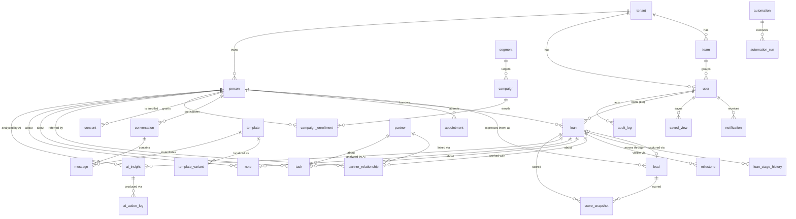

# Data_Model

Purpose: this document is the full entity catalog for the Loan Factory CRM's Postgres database — every table the implementation team needs for Phases 1–2, with fields, relationships, the locked 20-stage opportunity-stage enum, the row-level-security and tenancy rules that make borrower contact data safe by construction, a PII classification for every field, retention notes, and the indexing/scale decisions that keep it fast. It is the database-shaped twin of [[Technical_Architecture]] (which explains where this database sits) and it must be able to populate the 17 merge fields the 135-template communication library requires (see [[Communication_Templates]]) and record every AI action per the AI contract ([[AI_Product_Architecture]], [[Decisions]] D-05, D-11).

Conventions used throughout: every table has `id uuid primary key`, `tenant_id uuid not null references tenant`, `created_at timestamptz`, `updated_at timestamptz`; user-deletable records also carry `deleted_at` (soft delete — nothing user-facing is hard-deleted). These standard columns are not repeated in the field tables below. **PII column legend:** `—` = not personal data · **PII** = personal identifiers/contact data · **NPI** = nonpublic personal financial information (GLBA-sensitive) · **Restricted** = never stored, in any phase (listed only to show what is deliberately excluded).

---

## 1. Entity catalog at a glance

| # | Entity | One-line role | Phase |
|---|---|---|---|
| 1 | `tenant` | The business unit that owns all data below it | 1 |
| 2 | `team` | Grouping of users under a team leader (Team nav) | 1 |
| 3 | `user` | Staff account with one of 8 roles | 1 |
| 4 | `person` | Every human relationship: borrower, lead, past client | 1 |
| 5 | `lead` | Acquisition-episode metadata for the opportunity it opened (§3.5) | 1 |
| 6 | `loan` | The CRM opportunity record moving through the 20 stages | 1 |
| 7 | `loan_stage_history` | Immutable milestone record of every stage move | 1 |
| 8 | `task` | A unit of work with an owner and a due date | 1 |
| 9 | `note` | Freeform memory on any record | 1 |
| 10 | `conversation` / `message` | Every thread and every message, all channels | 1 |
| 11 | `consent` | Per-person, per-channel permission ledger | 1 |
| 12 | `template` / `template_variant` | The EMT communication library + language variants | 1 |
| 13 | `segment` | Plain-English dynamic/static/combined audience lists | 1 |
| 14 | `campaign` / `campaign_enrollment` | Multi-step outreach over a segment | 2 |
| 15 | `automation` / `automation_run` | Plain-language trigger→action rules + run history | 2 |
| 16 | `partner` / `partner_relationship` | Referral partners and their links to people/loans | 2 |
| 17 | `event` | Domain event stream driving automations | 1 |
| 18 | `ai_insight` | Everything AI proposes (briefings, next actions, drafts) | 1 |
| 19 | `ai_action_log` | Immutable log of every model call and approval | 1 |
| 20 | `score_snapshot` | Point-in-time scores with documented factors | 1 |
| 21 | `audit_log` | Append-only record of every mutation | 1 |
| 22 | `embedding` | pgvector memory for AI retrieval | 1 |
| 23 | `milestone` | Read-only third-party progress visibility per opportunity: appraisal, title, insurance | 2 |
| 24 | `appointment` | Scheduled consultations/calls/closings feeding the Today calendar strip | 1 |
| 25 | `notification` | In-app notification feed (Screen 18) | 1 |
| 26 | `stage_checklist_template` | Per-stage advance-gate checklists (LW-02, TC-04) | 2 |
| 27 | `saved_view` | User-saved pipeline/people filter views (PT-03) | 1 |

## 2. ERD

(Every entity also relates to `tenant`; omitted above for readability. `event` fans out to automations and is not drawn.)

---

## 3. Entities in full

### 3.1 `tenant`

| Field | Type | PII | Notes |
|---|---|---|---|
| `name` | text | — | e.g. "Loan Factory" |
| `status` | enum: active, suspended | — | |
| `company_nmls` | text | — | Display value "320841"; required on outbound comms |
| `settings` | jsonb | — | Branding, default language set (en, vi first-class), compliance defaults — including **lender-paid compensation only** (proven business rule, [[Asset_Inventory]]), state-rule toggles (maintainable data, never hardcoded — the lesson from the Legends OS content-system discovery) |
| `plan` | text | — | Phase 4 white-label/billing hook; unused until then |

Retention: never deleted; suspension freezes access, data retained per contract.

### 3.2 `team`

| Field | Type | PII | Notes |
|---|---|---|---|
| `name` | text | — | Teams may be organized by language/region/niche (Vietnamese team, investor team — per the team-marketing knowledge pack) |
| `leader_user_id` | uuid → user | — | |
| `branch` | text | — | Simple label until Phase 4 multi-branch controls |

### 3.3 `user`

| Field | Type | PII | Notes |
|---|---|---|---|
| `auth_user_id` | uuid | — | Link to Supabase Auth (MFA lives there) |
| `role` | enum: `lo`, `lo_assistant`, `processor`, `team_leader`, `branch_leader`, `agent_rel_manager`, `marketing_coordinator`, `admin` | — | The 8 CANON staff types (+admin). These are the only product users: borrowers are CRM contacts (`person` rows), never account holders — there is no borrower login |
| `full_name` | text | PII | Feeds `{{LoanOfficerName}}`, `{{ProcessorName}}`, `{{LoanCoordinatorName}}` merge fields |
| `email` | text | PII | |
| `phone` | text | PII | Feeds `{{PhoneNumber}}` |
| `nmls_id` | text | — | Feeds `{{NMLS}}`; required in every LO signature |
| `team_id` | uuid → team | — | |
| `language` | enum: en, vi, zh, es, ru | — | UI language preference |
| `website_url` | text | — | Per-LO Loan Factory website; feeds `{{Website}}` and `{{ApplicationLink}}` defaults |
| `status` | enum: active, invited, disabled | — | |

### 3.4 `person`

The human. One row per human, regardless of how many leads or loans they generate. This is the People module's backbone and the source for `{{BorrowerName}}`.

| Field | Type | PII | Notes |
|---|---|---|---|
| `first_name`, `last_name` | text | PII | |
| `emails` | jsonb array | PII | Primary + alternates, each with label and verified flag |
| `phones` | jsonb array | PII | Each with label, sms-capable flag |
| `mailing_address` | jsonb | PII | Street/city/state/zip |
| `date_of_birth` | date | PII | Birthday automations; store full date only if provided |
| `preferred_language` | enum: en, vi, zh, es, ru | PII | **First-class per D-08** — drives template variant selection, AI draft language |
| `type` | enum: lead, borrower, past_client, other | — | Denormalized convenience; truth derives from lead/loan state |
| `owner_user_id` | uuid → user | — | The LO who owns the relationship (RLS visibility anchor) |
| `source` | jsonb | — | First-touch attribution (see `lead.source` structure) |
| `tags` | text[] | — | Lightweight labels |
| `do_not_contact` | boolean | — | Global kill switch, checked before consent (belt and suspenders) |
| `complaint_flag`, `complaint_opened_at` | boolean / timestamptz | — | Active-complaint suppression: while set, automations and marketing sends to this person halt (FR-AU-5, INV-6); clearing it is an audited action |
| `merged_into_person_id` | uuid → person | — | Duplicate-merge trail (same-name borrowers are a tested edge case) |

Deliberately absent (Restricted class): SSN, credit scores/reports, income, assets, bank details, government IDs. These live in the LOS/POS and other loan-origination systems of record — permanently outside the CRM boundary, in every phase. FICO **range** as self-reported on a lead form is the one exception, stored on `lead`.

### 3.5 `lead`

An acquisition episode — **not** a parallel pipeline. Locked rule, ending the lead-vs-loan ambiguity: **capturing a lead creates a `loan` row in the same transaction, at stage 1 `new_lead`.** There is exactly one lifecycle state machine — `loan.stage` — and the Pipeline board's ENGAGE and QUALIFY columns render loan cards like every other column (PB-10's all-20-stages requirement is satisfied by construction). `lead` records only how the episode began: the source, the self-reported details, and speed-to-lead. A person can still have many leads over the years (bought in 2026, refi inquiry in 2028) — each capture opens its own opportunity record, and keeping leads separate from people still prevents the prototype's core modeling error (contact = loan). "Conversion" is therefore not a record-creation event; it is the loan advancing out of QUALIFY. The Lead inbox is a filtered view over stage 1–2 loans joined to this table, so "the lead's stage advances 1 New Lead → 2 Contact Attempt" (LI-03) means the loan's stage advances.

| Field | Type | PII | Notes |
|---|---|---|---|
| `person_id` | uuid → person | — | |
| `loan_id` | uuid → loan | — | The stage-1 loan this capture opened — set at creation, not at "conversion" |
| `source` | jsonb | — | **Structured, first-class**: `{channel, campaign, ad, form, widget, detail}` — e.g. channel `facebook_ads` (the "Automatically Created" stream), `lf_website`, `widget:rate_table`, `qm_pricer`, `manual`, `csv_import`, `partner_referral`. Fixes the weak provenance flagged in discovery |
| `intent` | enum: purchase, refinance, heloc, quote, rate_alert, qualify, unknown | — | QM Pricer's create-alert/apply/qualify buttons are distinct intents worth distinguishing |
| `assigned_user_id` | uuid → user | — | Default-LO routing mirrors the existing Facebook Ads concept |
| `first_response_at` | timestamptz | — | Speed-to-lead SLA metric for Intelligence |
| `stated_price_range`, `stated_location` | text | PII | Self-reported shopping details |
| `stated_fico_range` | text | NPI | Self-reported band only (e.g. "700–719" from widget forms); never a pulled score |

Dead episodes are recorded on the loan (`status = lost` + `lost_reason`), not here — a lead has no status enum of its own.

Retention: leads whose loans died in ENGAGE/QUALIFY and go cold are purge candidates (see §6).

### 3.6 `loan` — the CRM opportunity record, with the locked 20-stage enum

`loan` is the CRM's opportunity record: one row per lending relationship episode, tracking where that relationship stands across the 20 stages so follow-up, automations, and reporting can react. A row exists from stage 1: it is created automatically at lead capture (§3.5) or manually for walk-in/referral business. Early-stage rows are deliberately thin — the TRANSACT milestone fields below stay null until the file gets there, and the UI never asks for them earlier.

Boundary note: every stage, date, and milestone field below is **visibility and communication-trigger metadata, not loan-of-record data**. The team enters these facts manually in v1; future integrations may sync them in **read-only** from the LOS/POS, which remain the systems of record. The CRM never originates, underwrites, prices, discloses, processes, or services anything — it uses these facts solely to time the right relationship touch.

| Field | Type | PII | Notes |
|---|---|---|---|
| `person_id` | uuid → person | — | Primary borrower. Co-borrowers: `loan_participant` join table (person_id, role: co_borrower/non_borrowing_spouse) — small, added when needed |
| `lo_user_id` | uuid → user | — | File owner (RLS visibility anchor) |
| `processor_user_id`, `coordinator_user_id` | uuid → user | — | Feed `{{ProcessorName}}`, `{{LoanCoordinatorName}}` |
| `stage` | enum `loan_stage` (below) | — | Current stage; **every change must write `loan_stage_history` in the same transaction** |
| `purpose` | enum: purchase, refinance, cash_out_refi, heloc, construction, other | — | |
| `program` | text + enum-ish catalog | — | Conventional, FHA, VA, USDA, jumbo, DSCR, bank statement, ITIN, foreign national, reverse, etc. Feeds `{{LoanProgram}}` and collapses the library's near-clone specialty templates into one parameterized template |
| `amount` | numeric | NPI | Loan amount |
| `property_address` | jsonb | PII | Feeds `{{PropertyAddress}}` |
| `property_type`, `occupancy` | enum | — | |
| `lender_name` | text | — | Feeds `{{LenderName}}` (broker model: which lender the file went to) |
| `rate_lock_date`, `rate_lock_expires_at` | date | NPI | Lock expiration drives Today-screen urgency |
| `appraisal_ordered_at`, `appraisal_due_date`, `appraisal_received_at` | date | — | Feed `{{AppraisalDate}}`/`{{AppraisalDueDate}}` and appraisal automations |
| `closing_date` | date | — | Feeds `{{ClosingDate}}` |
| `funded_at` | date | — | |
| `loan_number` | text | — | Tenant-scoped human-readable file number (Screen 5 LoanHeader) |
| `preapproval_amount` | numeric | NPI | Preapproval letter amount (read-only relationship fact) — C-02 congratulations trigger, Screen 4 PreapprovalPanel |
| `preapproval_issued_at`, `preapproval_expires_at` | date | NPI | Expiry drives C-04 and the Today expiring-preapproval class |
| `six_elements_at` | timestamptz | — | Six-element application received (fact recorded for visibility — the stage 9 KPI: six-element→LE-out time) |
| `le_due_at` | timestamptz | — | LE due date, derived from `six_elements_at` (3 business days) — urgency visibility only; the LOS owns the actual TRID workflow |
| `intent_to_proceed_at` | timestamptz | — | |
| `disclosures_sent_at`, `disclosures_signed_at` | timestamptz | — | E-05/E-06 unsigned-disclosure clocks; stage 10 stall clock |
| `cd_sent_at`, `cd_acknowledged_at` | timestamptz | — | CD timing; stage 14 mechanics |
| `ctc_issued_at` | timestamptz | — | Clear-to-close automations and stage 14 stall clock |
| `lost_reason` | text | — | Why a file died, at any stage (moved here from `lead`) |
| `application_link` | text | — | Feeds `{{ApplicationLink}}` — the per-LO link to the external application site, merged into outbound communications (the CRM never hosts an application) |
| `docs_needed` | boolean | — | Communication flag: the team marks that the file is waiting on borrower items, driving the D-01–D-03 follow-up nudges. Deliberately **not** a per-item tracker — the needs list itself lives in the LOS/POS |
| `docs_needed_summary` | text | — | Optional plain-language summary for merge into follow-up drafts ("last 2 pay stubs, 2024 W-2") |
| `docs_needed_since` | timestamptz | — | Set when the flag is raised; age drives chase cadence and the stall clocks; cleared with the flag |
| `stalled_since` | timestamptz | — | Set by the stall sweep; null when healthy |
| `external_refs` | jsonb | — | Reserved for future read-only integrations: external system record IDs (LOS/POS), so synced-in facts can be traced to their source |
| `status` | enum: active, funded, lost, withdrawn, denied, on_hold | — | Terminal disposition, orthogonal to stage (`lost` = died in ENGAGE/QUALIFY before application) |

Note on merge fields: with `person` + `loan` + `user` + `tenant` above, all 17 tokens used across the 135 templates resolve from live data — this table set is the data-model contract the library demands.

Automation backing columns: every milestone-driven trigger resolves to a named column or table here — C-02/C-04 → `preapproval_*`; E-05/E-06 → `disclosures_sent_at`/`disclosures_signed_at`; stage 10/14 stall clocks → `disclosures_sent_at`, `cd_sent_at`, `ctc_issued_at`; D-01–D-07 docs-needed follow-ups → `docs_needed`/`docs_needed_since`; third-party updates → `milestone` (§3.23). [[Automation_Catalog]] should cite the backing column beside each trigger.

**`loan_stage` enum (locked names, CANON):**

| Macro-phase | # | Stage value |
|---|---|---|
| ENGAGE | 1 | `new_lead` |
| | 2 | `contact_attempt` |
| | 3 | `consultation_scheduled` |
| | 4 | `consultation_completed` |
| QUALIFY | 5 | `prequalification` |
| | 6 | `preapproval` |
| | 7 | `searching_for_home` |
| TRANSACT | 8 | `under_contract` |
| | 9 | `application` |
| | 10 | `disclosures` |
| | 11 | `processing` |
| | 12 | `submitted_to_underwriting` |
| | 13 | `conditional_approval` |
| | 14 | `clear_to_close` |
| | 15 | `closing_scheduled` |
| | 16 | `funded` |
| RETAIN | 17 | `post_close` |
| | 18 | `annual_review` |
| GROW | 19 | `refinance_opportunity` |
| | 20 | `referral_retention` |

Macro-phase is derived (a lookup, not a column). Display names are the CANON English labels with VI translations in the i18n layer — the enum values never localize.

### 3.7 `loan_stage_history` (milestone history)

| Field | Type | PII | Notes |
|---|---|---|---|
| `loan_id` | uuid → loan | — | |
| `from_stage`, `to_stage` | loan_stage | — | `from_stage` null on creation |
| `changed_by` | uuid → user, nullable | — | Null + `changed_via` explains automation-driven moves |
| `changed_via` | enum: user, automation, import | — | |
| `entered_at` | timestamptz | — | Days-in-stage, cycle-time analytics, and stall detection all compute from this table |
| `note` | text | — | Optional reason (e.g. "moved back to Processing — appraisal revision") |

Append-only; never updated or deleted. This is the milestone record CANON requires and the source for privacy-safe partner status sharing (partners see stage names and dates from here — never financials).

### 3.8 `task`

| Field | Type | PII | Notes |
|---|---|---|---|
| `title` | text | — | |
| `body` | text | PII possible | Free text may mention personal details — treat as PII for export/purge |
| `assignee_user_id` | uuid → user | — | |
| `due_at` | timestamptz | — | |
| `priority` | enum: urgent, high, normal, low | — | Today-screen stack respects this plus scoring |
| `status` | enum: open, snoozed, done, cancelled | — | Snooze requires `snoozed_until` + `snooze_reason` (the "snooze with reason" pattern from [[Information_Architecture]]) |
| `person_id`, `loan_id`, `partner_id` | uuid, nullable | — | At most one subject set; enforced by check constraint |
| `origin` | enum: user, ai, automation | — | Who created it — attribution per the AI contract |
| `origin_ref` | uuid | — | ai_insight or automation_run that spawned it |

### 3.9 `note`

| Field | Type | PII | Notes |
|---|---|---|---|
| `body` | text (markdown) | PII possible | Relationship memory; embedded for AI retrieval |
| `author_user_id` | uuid → user | — | |
| `person_id`, `loan_id`, `partner_id` | uuid, nullable | — | One subject |
| `pinned` | boolean | — | |
| `is_ai_generated` | boolean | — | e.g. AI call summary (Phase 3 voice) — always labeled, never silently mixed with human notes |

### 3.10 `conversation` and `message`

| `conversation` field | Type | PII | Notes |
|---|---|---|---|
| `person_id` / `partner_id` | uuid, nullable | — | Counterparty (one set) |
| `loan_id` | uuid, nullable | — | Optional file context |
| `channel` | enum: email, sms, internal | — | Phone/voice logging is Phase 3 |
| `subject` | text | PII possible | |
| `last_message_at`, `unread_count` | — | — | Inbox sort |

| `message` field | Type | PII | Notes |
|---|---|---|---|
| `conversation_id` | uuid → conversation | — | |
| `direction` | enum: outbound, inbound | — | |
| `from_address`, `to_addresses` | text / jsonb | PII | |
| `body_html`, `body_text` | text | PII/NPI possible | Message content is the most sensitive routinely-stored data; encrypted at rest (database-level) and access-logged |
| `language` | enum | — | Language actually sent — must match `person.preferred_language` unless the user overrides |
| `template_id`, `template_variant_id` | uuid, nullable | — | Which EMT template produced it |
| `merge_data` | jsonb | PII | Snapshot of resolved merge fields at send time (auditability: what the borrower actually saw) |
| `status` | enum: draft, pending_approval, approved, queued, sent, delivered, opened, clicked, bounced, failed, cancelled | — | The approval states are the AI contract in schema form |
| `is_ai_drafted` | boolean | — | |
| `approved_by_user_id`, `approved_at` | uuid / timestamptz | — | **Required non-null before any AI-drafted or automation-queued outbound message may reach `queued`** — enforced by trigger, not convention |
| `consent_check` | jsonb | — | Consent status recorded at send time (proof, not just a gate) |
| `provider`, `provider_message_id` | text | — | Delivery adapter linkage |
| `compliance_lint` | jsonb | — | Result of the deterministic + AI compliance check (blockers/warnings), stored with the message |

### 3.11 `consent`

The permission ledger. Sends are refused without a current opt-in for the channel; this table is why that refusal is provable.

| Field | Type | PII | Notes |
|---|---|---|---|
| `person_id` | uuid → person | — | |
| `channel` | enum: email, sms, phone, mail | — | SMS consent is stricter (TCPA) — see [[Mortgage_Compliance]] |
| `status` | enum: opted_in, opted_out, unknown, pending_double_optin | — | |
| `method` | enum: web_form, verbal_logged, import_attested, unsubscribe_link, sms_stop, manual | — | How consent/opt-out was captured |
| `evidence` | jsonb | — | Form URL, IP, timestamp, importing user's attestation, raw STOP message id |
| `effective_at` | timestamptz | — | |
| `recorded_by` | uuid → user, nullable | — | |

Append-only: status changes insert a new row; current status = latest row per (person, channel). Never purged, even if the person is deleted — opt-outs must survive deletion (suppression list keeps a hashed identifier).

### 3.12 `template` and `template_variant`

| `template` field | Type | PII | Notes |
|---|---|---|---|
| `emt_id` | text, nullable, unique per tenant | — | Stable external ID (EMT-001…135) for imported library templates; null for user-authored ones. Never reused/renamed, per the library's own naming rule |
| `name`, `category` | text | — | |
| `loan_stage` | loan_stage, nullable | — | Stage-aware, never a flat gallery (D-07) |
| `audience` | enum: borrower, realtor, internal, other_partner | — | Drives the partner privacy wall |
| `channel` | enum: email, sms | — | |
| `subject`, `body` | text | — | English master is the source of truth |
| `merge_fields` | text[] | — | Declared tokens; send-time validation fails fast on unpopulatable fields (the prototype's "no email on file — will be skipped" health-check pattern, done properly) |
| `automation_policy` | enum: fully_automated, semi_automated, manual_only, never_automate | — | **Authoritative policy column.** Per the discovery finding, the library's `tags` conflict with policy on the most sensitive templates — policy is imported from the Workflow_Triggers/CRM_Automation_Map tables only, never from tags |
| `stop_conditions`, `prerequisites` | jsonb | — | From the library's automation map |
| `compliance_notes` | text | — | |
| `scope` | enum: company, personal | — | Company library vs user's own |
| `version`, `is_active` | int / boolean | — | Edits create versions; sent messages reference the version they used |

| `template_variant` field | Type | PII | Notes |
|---|---|---|---|
| `template_id` | uuid → template | — | |
| `language` | enum: vi, zh, es, ru | — | Per-template language variants (D-08). Seeded from the library's per-stage localization modules — honestly thinner than per-template translations |
| `subject`, `body` | text | — | |
| `review_status` | enum: machine_draft, human_reviewed, approved | — | **Non-approved variants cannot be auto-selected**; AI flags "human translation review required" per the library's own rule |

### 3.13 `segment`

| Field | Type | PII | Notes |
|---|---|---|---|
| `name` | text | — | |
| `kind` | enum: dynamic, static, combined | — | The one taxonomy kept from the prototype |
| `rule` | jsonb | — | Structured filter compiled from the plain-English builder ("Funded & rate drop ≥ 0.5%") — **stored as structured rules, rendered as plain English**, never string-matched by name (prototype anti-pattern) |
| `member_person_ids` | via `segment_member` join (static) | — | Dynamic membership computed at read/run time; combined = set ops over child segment ids in `rule` |

### 3.14 `campaign` and `campaign_enrollment`

| `campaign` field | Type | PII | Notes |
|---|---|---|---|
| `name` | text | — | |
| `kind` | enum: drip, broadcast, nurture, event | — | |
| `segment_id` | uuid → segment | — | Audience |
| `steps` | jsonb | — | Ordered steps: template ref + delay + channel + stop conditions |
| `status` | enum: draft, active, paused, archived | — | |
| `owner_user_id` | uuid → user | — | |
| `review_status` | enum: draft, needs_review, approved, changes_requested, rejected | — | The approval state machine proven in the Legends OS content system, reused |

| `campaign_enrollment` field | Type | PII | Notes |
|---|---|---|---|
| `campaign_id`, `person_id` | uuid | — | |
| `current_step`, `next_run_at` | int / timestamptz | — | |
| `status` | enum: active, completed, exited, suppressed | — | `exited` records `exit_reason` (stage advanced, replied, opted out — stop conditions always win) |

### 3.15 `automation` and `automation_run`

| `automation` field | Type | PII | Notes |
|---|---|---|---|
| `name` | text | — | Plain language, user-facing ("When a file goes Clear to Close…") |
| `trigger_event` | text | — | From the event catalog ([[Automation_Catalog]]) |
| `conditions` | jsonb | — | Structured predicates |
| `actions` | jsonb | — | Ordered: send template (policy-gated), create task, notify user, wait, update field |
| `policy_tier` | enum mirroring template policy | — | Engine hard-blocks auto-send for manual_only/never_automate actions regardless of configuration |
| `status` | enum: active, paused, draft | — | |
| `scope` | enum: company, team, personal | — | |
| `n8n_workflow_id` | text, nullable | — | Internal mapping for integration-backed automations; **never surfaced in UI** |

| `automation_run` field | Type | PII | Notes |
|---|---|---|---|
| `automation_id` | uuid | — | |
| `triggered_by_event_id` | uuid → event | — | |
| `subject_person_id` / `subject_loan_id` | uuid | — | |
| `status` | enum: running, waiting_approval, completed, stopped, failed | — | `stopped` records which stop condition fired |
| `steps_log` | jsonb | — | Per-step outcome in plain language for the run-history UX |
| `started_at`, `finished_at` | timestamptz | — | |

### 3.16 `partner` and `partner_relationship`

| `partner` field | Type | PII | Notes |
|---|---|---|---|
| `kind` | enum: real_estate_agent, builder, cpa, attorney, financial_planner, other | — | |
| `full_name`, `email`, `phone` | text | PII | Feeds `{{RealtorName}}` |
| `company`, `license_number` | text | — | Brokerage / state license |
| `owner_user_id` | uuid → user | — | Relationship owner (LO or agent relationship manager) |
| `status` | enum: prospecting, active, dormant | — | "Going quiet" sweeps flip active→dormant candidates |
| `last_touch_at` | timestamptz | — | |
| `preferred_language` | enum | PII | Same multilingual treatment as people |

| `partner_relationship` field | Type | PII | Notes |
|---|---|---|---|
| `partner_id` | uuid → partner | — | |
| `person_id` / `loan_id` | uuid, nullable | — | |
| `role` | enum: buyer_agent, listing_agent, referrer, service_provider | — | |
| `referred_at` | timestamptz | — | Referral scorecards (leads sent, funded volume, cycle time) are computed from this table + loans — no stored counters to drift |

Privacy rule in schema: partner-facing surfaces read **only** partner tables, `loan_stage_history` (stage + dates), and file-owner names. There is no query path from a partner-facing view to amounts, rates, or any NPI field — enforced by dedicated database views granted to the partner-share feature.

### 3.17 `event`

| Field | Type | PII | Notes |
|---|---|---|---|
| `type` | text | — | Catalog seeded from the communication framework's trigger vocabulary (lead captured, stage advanced, disclosures unsigned 24h, appraisal received, CTC issued, funded, annual review due…) |
| `subject_type`, `subject_id` | text / uuid | — | |
| `payload` | jsonb | — | Minimal facts; consumers re-read live records at execution time (stop-condition freshness) |
| `emitted_by` | enum: user, system, integration | — | |
| `processed_at` | timestamptz | — | Queue consumption marker |

### 3.18 `ai_insight`

Everything AI proposes, in one shape, all routed through approval.

| Field | Type | PII | Notes |
|---|---|---|---|
| `kind` | enum: daily_briefing, next_best_action, draft_message, stall_alert, stage_entry_checklist, lead_triage, partner_going_quiet, reactivation, compliance_flag, data_hygiene | — | Grows by migration, not free text |
| `subject_person_id` / `subject_loan_id` / `subject_partner_id` | uuid, nullable | — | |
| `for_user_id` | uuid → user | — | Whose queue it appears in |
| `title`, `body` | text | PII possible | Plain-language card content |
| `explanation` | text | — | **Required.** The plain-language "why" ("#1 because it arrived 40 minutes ago from your Facebook ad and hasn't been called") — the explainability requirement from D-11 and the persona pack's SOURCE-UNCLEAR risk tag |
| `proposed_action` | jsonb | — | e.g. draft message id, task spec — the one-tap payload |
| `status` | enum: proposed, approved, edited_then_approved, dismissed, expired | — | The three approval outcomes feed AI quality metrics ([[Technical_Architecture]] §8) |
| `resolved_by`, `resolved_at` | uuid / timestamptz | — | |
| `expires_at` | timestamptz | — | Stale insights self-expire; nothing nags forever |

### 3.19 `ai_action_log`

Immutable, append-only. One row per model-gateway call; the audit trail CANON demands.

| Field | Type | PII | Notes |
|---|---|---|---|
| `caller` | enum: user_request, insight_job, automation, compliance_lint | — | |
| `user_id` | uuid, nullable | — | Human on whose behalf, when applicable |
| `model`, `prompt_name`, `prompt_version` | text | — | Prompt registry reference — reproducibility |
| `subject_refs` | jsonb | — | Entities the call read |
| `input_summary` | jsonb | — | Redacted/structured summary — **not** raw prompt text containing PII |
| `output_ref` | uuid, nullable | — | ai_insight / message draft produced |
| `tokens_in`, `tokens_out`, `cost_usd`, `latency_ms` | numeric | — | Per-tenant spend metering |
| `outcome` | enum: ok, refused, error, guardrail_blocked | — | `guardrail_blocked` = compliance lint or injection filter stopped it |

### 3.20 `score_snapshot`

Point-in-time scores with documented factors — the fair-lending evidence trail (D-11).

| Field | Type | PII | Notes |
|---|---|---|---|
| `subject_type` | enum: lead, loan, partner | — | Lead priority, loan stall risk, partner health |
| `subject_id` | uuid | — | |
| `score` | numeric | — | |
| `model_version` | text | — | Scoring logic is versioned; every change is a migration + Decisions entry |
| `factors` | jsonb | — | **Complete list of factors and weights used** — behavioral and file-progress signals only (recency, response time, stage age, engagement). Protected classes and proxies (including language preference and geography below state level) are structurally absent from the feature set, not just unused |
| `computed_at` | timestamptz | — | Snapshots retained (not overwritten) so the periodic disparate-impact review can reconstruct any past ranking |

### 3.21 `audit_log`

| Field | Type | PII | Notes |
|---|---|---|---|
| `actor_type` | enum: user, ai, automation, system | — | |
| `actor_id` | uuid, nullable | — | |
| `verb` | text | — | created, updated, stage_changed, sent, approved, merged, exported, deleted… |
| `entity_type`, `entity_id` | text / uuid | — | |
| `diff` | jsonb | PII possible | Before/after of changed fields only |
| `context` | jsonb | — | IP, session id, automation_run id |
| `at` | timestamptz | — | |

Append-only, no update/delete grants to any role including admin. Written by database triggers on the core tables plus explicit application writes for non-CRUD verbs (export, view-sensitive).

### 3.22 `embedding`

| Field | Type | PII | Notes |
|---|---|---|---|
| `subject_type`, `subject_id` | text / uuid | — | note, message, template, person summary… |
| `chunk_index`, `chunk_text` | int / text | PII possible | Text is duplicated here — purges must cascade (see §7) |
| `vector` | vector(dim) | — | pgvector; one table, not per-entity columns |
| `model`, `refreshed_at` | text / timestamptz | — | Re-embed on model upgrade |

### 3.23 `milestone`

Read-only third-party progress visibility per opportunity: appraisal, title, insurance, conditions-cleared. These are plain status facts the team records so communication can react ("appraisal came back — tell the borrower and both agents"); the work itself — ordering the appraisal, clearing title, resolving conditions — happens in the LOS/POS and vendor systems, which stay the systems of record. Rows are entered manually in v1; future integrations may populate them read-only. The appraisal date columns on `loan` remain as merge-field feeds and are kept in sync with the appraisal milestone row. Docs-needed follow-up is deliberately *not* modeled here — it is the lightweight `loan.docs_needed` flag (§3.6), never a per-item tracker.

| Field | Type | PII | Notes |
|---|---|---|---|
| `loan_id` | uuid → loan | — | |
| `kind` | enum: appraisal, title, insurance, conditions_cleared | — | `conditions_cleared` is a single visibility fact — the CRM never tracks individual underwriting conditions |
| `status` | enum: not_started, ordered, in_progress, complete, issue | — | `issue` records a plain-language note |
| `ordered_at`, `due_at`, `completed_at` | timestamptz | — | |

### 3.24 `appointment`

Consultations, calls, closings — the Today calendar strip and the B-01/B-02 reminder automations read from here.

| Field | Type | PII | Notes |
|---|---|---|---|
| `user_id` | uuid → user | — | Host |
| `person_id`, `loan_id`, `partner_id` | uuid, nullable | — | Subject(s) |
| `kind` | enum: consultation, call, closing, meeting, other | — | |
| `starts_at`, `ends_at` | timestamptz | — | |
| `location` | jsonb | — | Address or video link |
| `status` | enum: scheduled, completed, no_show, cancelled | — | `no_show` feeds re-engagement automations |
| `external_calendar_ref` | text, nullable | — | Google Calendar linkage |

### 3.25 `notification`

The in-app notification feed (Screen 18, ships Phase 1). Distinct from `ai_insight`: notifications are facts ("appraisal received"), insights are proposals.

| Field | Type | PII | Notes |
|---|---|---|---|
| `user_id` | uuid → user | — | Recipient |
| `kind` | text | — | From the event catalog |
| `title`, `body` | text | PII possible | |
| `subject_type`, `subject_id` | text / uuid | — | Deep-link target |
| `read_at` | timestamptz, nullable | — | |

### 3.26 `stage_checklist_template`

Per-stage advance-gate checklists — what must be true before a loan may leave a stage (LW-02, TC-04). Per-loan completion lives in a small companion table `loan_checklist_item` (loan_id, template_item_ref, checked_by, checked_at).

| Field | Type | PII | Notes |
|---|---|---|---|
| `loan_stage` | loan_stage | — | Which stage this gates |
| `items` | jsonb | — | Ordered items: label, required boolean, hint |
| `scope` | enum: company, team | — | |
| `version`, `is_active` | int / boolean | — | Loans reference the version they were gated by |

### 3.27 `saved_view`

User-saved filter/sort views over list surfaces (PT-03).

| Field | Type | PII | Notes |
|---|---|---|---|
| `user_id` | uuid → user | — | |
| `surface` | enum: pipeline, people, partners, conversations | — | |
| `name` | text | — | |
| `filters`, `sort` | jsonb | — | Structured, like `segment.rule` |
| `is_default` | boolean | — | |

---

## 4. RLS and tenancy rules

1. **RLS is enabled on every table, no exceptions**, including logs. Default policy: `tenant_id = auth.jwt() ->> 'tenant_id'`. A missing/invalid claim yields zero rows.
2. **Ownership layer on top of tenancy.** Within a tenant: LOs and LO assistants see people/leads/loans where they are owner, assignee, or named participant (processor/coordinator); processors see files assigned to them; team leaders see their team's book; branch leaders and admins see the tenant; agent relationship managers see partners plus privacy-safe loan status; marketing coordinators see segments, templates, campaigns, and aggregate stats — not individual loan financials. Implemented as RLS `USING` clauses over the ownership columns (`owner_user_id`, `lo_user_id`, `assigned_user_id`, team membership) — visibility rules live in the database, matching the role matrix in [[Information_Architecture]].
3. **Append-only tables** (`audit_log`, `ai_action_log`, `loan_stage_history`, `consent`, `score_snapshot`): INSERT and SELECT policies only; UPDATE/DELETE granted to no role.
4. **Partner-share surfaces** read only through dedicated views that project stage names, dates, and file-owner name — the NPI columns are not in the view definition, so a bug cannot leak them.
5. **Service/job access**: background jobs set an explicit tenant context per job; the unrestricted service key never leaves the job runner ([[Technical_Architecture]] §4). n8n has no database credentials at all.
6. **No borrower access path exists.** There is no JWT audience, role, or policy that grants a `person` access to anything — borrowers are contacts, not users, and the schema deliberately provides no seam for adding a borrower-facing surface later.

## 5. PII classification summary

| Class | Fields (representative) | Handling |
|---|---|---|
| — (business data) | Stages, statuses, templates, automations, scores, logs' structural fields | Standard controls |
| **PII** | Names, emails, phones, addresses, DOB, language preference, free-text bodies (notes, messages, tasks) | Encrypted at rest (platform-level); access via RLS only; included in export/delete workflows; masked in non-production environments (staging uses fake data only, per [[QA_Plan]]) |
| **NPI** (GLBA) | Loan amount, preapproval amount, rate-lock data, stated FICO range, any financial detail inside message bodies | Everything PII gets, plus: excluded from partner-facing views by construction; bulk-export access audited; reaches the model gateway **only via an explicit field-level allowlist** — the NPI merge fields AI drafting legitimately needs (loan amount, loan program, preapproval amount and expiry, key milestone dates) may enter prompts under the no-training DPA, enforced and logged per call at the gateway ([[AI_Product_Architecture]] §10, "Data protection"); everything else — stated FICO range above all — is redacted and never prompted. The allowlist is versioned in the prompt registry so the control is auditable, rather than a blanket exclusion that drafting features would force engineers to silently break |
| **Restricted** (never stored) | SSN, credit reports/scores, income, assets, bank statements, government IDs, document images | Deliberately and permanently absent from the schema: this is loan-origination data, and it lives in the LOS/POS and document systems that own that work — outside the CRM boundary in every phase. AI's public-tool safety rule (never place Restricted-class data in prompts; NPI only per the allowlist above) is enforced at the model gateway |

Free-text fields are the honest weak point of any classification: notes and messages can contain anything. Mitigations: they are the most tightly RLS-scoped tables, they are access-logged, and the model gateway redacts recognized identifier patterns before text leaves the database boundary.

## 6. Retention notes

**[[Mortgage_Compliance]] §10 is the single authoritative retention schedule.** This section implements it and does not compete with it: where any number below and §10 disagree, §10 wins and this table gets corrected. One known discrepancy is flagged for counsel (C-2) now — a 5-year communications horizon (§10) vs the earlier 7-year engineering default — and the counsel outcome must be recorded in [[Decisions]] before the purge jobs are built. Implementation defaults, all configurable per tenant:

| Data | Default | Rationale |
|---|---|---|
| Loans, stage history, borrower messages, marketing/advertising records | Per [[Mortgage_Compliance]] §10 — counsel to confirm 5 vs 7 years after funding/withdrawal (C-2) | Regulatory record-keeping duty, not an engineering choice |
| Consent ledger | Life of consent + 5 years after revocation ([[Mortgage_Compliance]] §10); opt-outs survive person deletion via hashed suppression entry | An opt-out must outlive the record it protects |
| `audit_log`, `ai_action_log`, `score_snapshot` | 7 years | AI accountability + fair-lending review horizon |
| Cold leads (loan died in ENGAGE/QUALIFY, inactive) | Purge-eligible after 24 months, and only after the reviewed purge job verifies: no consent/opt-out evidence that must survive, no advertising-record linkage still under §10 retention, no linkage to a loan that progressed past QUALIFY | Data minimization with compliance carve-outs; runs as a reviewed job, not automatic silence |
| AI insights (dismissed/expired) | 12 months | Enough for quality analysis; no reason to hoard |
| Embeddings | Cascade-delete with their source row, always | Purged text must not survive in vector form |
| Soft-deleted rows | Hard-purge 90 days after `deleted_at`, **subordinate to retention class and legal hold**: a row still inside its §10 retention window (e.g. a message tied to a loan file) or under legal hold is hidden from the UI at soft-delete but is not physically purged until its retention clock and any hold expire | Undo window, then genuine deletion — but user deletion can never destroy records the tenant is legally required to keep |

## 7. Indexes and scale considerations

1. **Every foreign key and every RLS predicate column is indexed**, with `tenant_id` leading composite indexes on hot paths: `(tenant_id, lo_user_id, stage)` on loans; `(tenant_id, assignee_user_id, status, due_at)` on tasks; `(tenant_id, assigned_user_id, created_at)` on leads.
2. **Partial indexes for the Today screen**: `tasks WHERE status='open'`, `loans WHERE stage='new_lead'`, `loans WHERE stalled_since IS NOT NULL`, `loans WHERE docs_needed`, `messages WHERE status='pending_approval'` — the queries that run every minute stay index-only.
3. **`message` is the first big table** (campaigns multiply rows). Plan: monthly range partitioning by `created_at` when volume warrants (not day one), BRIN index on `created_at`, and delivery-status updates written as targeted single-row updates from provider webhooks.
4. **`audit_log` / `ai_action_log` / `event`**: append-only insert pattern, BRIN on time, no updates — cheap forever; partition by month once they pass tens of millions of rows.
5. **pgvector**: HNSW index on `embedding.vector`; embeddings refreshed by queue jobs, never inline with a user request.
6. **Dynamic segments** are computed at run time from `rule`; if segment evaluation gets hot, cache membership in `segment_member` with a `computed_at` freshness stamp (the stale-data edge case from the persona pack: freshness must be displayed, not hidden).
7. **Reporting** (Intelligence) reads materialized views refreshed on schedule — never heavy aggregate queries against operational tables during business hours ([[Technical_Architecture]] §9 defers a warehouse until Postgres genuinely can't).
8. **Realistic scale check**: hundreds of LOs × thousands of contacts each = low millions of people rows, tens of millions of messages/events over years. Comfortably Postgres territory with the above; nothing here needs exotic infrastructure — which is exactly why [[Technical_Architecture]] defers it.

Related: [[Technical_Architecture]] · [[AI_Product_Architecture]] · [[Automation_Catalog]] · [[Communication_Templates]] · [[Mortgage_Compliance]] · [[Information_Architecture]] · [[Decisions]]
