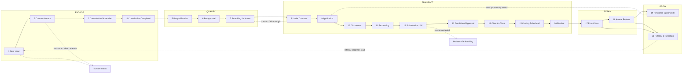

# Mortgage Workflow Map

Purpose: the definitive, stage-by-stage reference for the locked 20-stage opportunity lifecycle (see [[Decisions]] D-06) as Loan Factory CRM tracks it. For every stage it defines what the user is trying to do, what CRM-visible facts the system must hold, what actions the CRM recommends, what Ally prepares (and never sends — see D-05), which automations fire, which of the 135 communication templates apply (EMT IDs per the communication framework), what can go wrong, what compliance demands, what moves the opportunity forward, and what gets measured. It also fixes the rules for who may move an opportunity between stages, the stall thresholds that feed fallout-risk scoring, and a compact stage diagram. One boundary governs the whole map: the CRM tracks stages and milestone facts to drive relationship and communication work — the loan work itself (application intake, disclosures, document collection, underwriting, pricing, closing) happens in external origination systems, never in the CRM. This is the reference the [[PRD]], [[Automation_Catalog]], [[Communication_Templates]], [[Data_Model]], and [[Screen_Specifications]] all hang off.

---

## How to read this map

- **Stages are the locked 20** from [[Decisions]] D-06, grouped ENGAGE / QUALIFY / TRANSACT / RETAIN / GROW. The Pipeline board shows the 5 macro-phases as columns with drill-in to individual stages.
- **Templates** are cited by permanent `EMT-###` ID from the 135-template communication framework. Automation policy per template (Fully Automated 44 / Semi Automated 71 / Manual Only 20) comes from the framework's CRM Automation Map and Workflow Triggers docs — that policy column is authoritative; template tags are not. Even "Fully Automated" templates queue for one-tap approval in v1 (no autonomous borrower-facing sends).
- **Ally assistance** always means *prepared drafts, summaries, scores, and proposals* surfaced on [[Screen_Specifications|Today]] and in context — a human approves every outbound message and every stage move Ally proposes.
- **Automations** are internal-only actions (task creation, reminders, stage-move proposals, data checks) that may run without approval, plus approval-gated communication queues. Engine detail in [[Automation_Catalog]].
- **CRM-visible facts** (each stage's fact row) are the relationship and milestone facts the CRM holds to power stage visibility, triggers, and communication drafting. The team enters them in v1; future [[Integration_Map]] integrations may sync them **read-only** from source systems (LOS/POS/e-sign). The CRM never owns loan-of-record data and never performs the underlying loan work.
- **Stall thresholds** have two levels: **Watch** (surfaced on Today, yellow) and **At-Risk** (escalates to fallout-risk scoring and, where noted, notifies the LO's team leader — matching the framework's "Notify assigned LO and operations owner" escalation pattern). Thresholds are business hours/days. All values are proposed defaults, tenant-configurable — log as a decision.
- **Language:** every template send respects per-contact language preference. Vietnamese (and ZH/ES-CO/RU) coverage today is 5 lifecycle-stage body modules per language, not per-template translations — every non-English send is flagged "human translation review required" until per-template variants exist.

### Template coverage gaps (commission before Phase 2)
The framework has **no templates** for stages 3 (Consultation Scheduled), 4 (Consultation Completed), 7 (Searching for Home), or a dedicated stage-8 Under Contract kickoff, and no borrower re-attempt cadence for stage 2. These are the first new templates to commission (framework IDs EMT-136+, following the naming convention: new intent ⇒ new ID). Marked **GAP** below.

---

## Stage diagram

Terminal outcomes (**Lost**, **Withdrawn**, **Denied**, **Do Not Contact**) are **statuses with required reason codes, not stages** — an opportunity can exit from any stage without polluting the 20-stage model. Refi opportunities typically enter at stage 5 and skip 7–8. *(New decision — log in [[Decisions]].)*

---

## Stage-transition rules (who/what moves an opportunity)

| Rule | Detail |
|---|---|
| **Humans move opportunities** | The assigned LO, their assistant, or processing/ops staff (per [[Data_Model]] role permissions) can move an opportunity to any stage, forward or backward. Backward moves and terminal statuses **require a reason code** (feeds [[Screen_Specifications|Intelligence]] fallout analytics). |
| **Automations move opportunities only on verified events** | A stage auto-advances only when a source-of-truth event confirms it (e.g., "Disclosures signed," "Funding and recording confirmed"). Framework governance rule adopted verbatim: trigger confirmation must come from a source system or the assigned file owner. In Phase 1 (no LOS integration, D-10) "source system" means the LO/ops user logging the milestone fact — the event, not the automation, is the mover of record. Future integrations may sync these milestone facts **read-only** from the LOS/POS; the CRM never owns the loan of record. |
| **Ally never moves an opportunity autonomously** | Ally *proposes* stage moves ("Disclosures were signed yesterday — move to Processing?") as one-tap approval cards. The approval is the human act; the audit log records proposer (Ally), approver, timestamp, and evidence. |
| **Milestone-gated stages** | Stages 10, 12, 13, 14, 16 additionally require their gating milestone fact to be recorded (signed disclosures; UW submission; conditional approval; CTC issued; funding/recording confirmed) — the fact lives in the CRM as read-only visibility/trigger metadata; the artifacts themselves live in the source systems. The framework's prerequisite pattern applies: "Exact milestone confirmed in lender/source system" before any milestone-triggered template queues. |
| **Skips are legal, silent regressions are not** | Forward skips are allowed (refi enters at 5; cash buyer converting to financing may enter at 8). Every move — manual, automated, or Ally-approved — writes an immutable pipeline-history row: from-stage, to-stage, actor, reason/evidence. |
| **Stop conditions always override** | Any queued communication or cadence attached to the old stage is cancelled on stage change, response, opt-out, or milestone change (the framework's four stop-condition families). Stop conditions always override timing rules. |
| **One opportunity per transaction, many per person** | GROW conversions (19→new refi, 20→new purchase referral) spawn a **new opportunity record** on the same or a new People record; the funded opportunity stays in RETAIN history. *(New decision — log in [[Decisions]].)* |

---

## Stall thresholds (feeds fallout-risk scoring)

Clock = time in stage with no qualifying activity (activity definitions per stage below — qualifying activities are facts logged in the CRM). At-Risk raises the opportunity's fallout-risk score in [[AI_Product_Architecture]] and notifies LO + team leader where marked ⚠.

| # | Stage | Watch | At-Risk | Qualifying activity that resets the clock |
|---|---|---|---|---|
| 1 | New Lead | 1 business hour | 4 business hours ⚠ | First outreach attempt logged |
| 2 | Contact Attempt | 2 business days since last attempt | 5 business days / 6 attempts ⚠ | Any logged attempt; two-way contact exits stage |
| 3 | Consultation Scheduled | Appointment >7 days out | No-show, or 2 days past appointment with no outcome ⚠ | Confirmation, reschedule, held |
| 4 | Consultation Completed | 2 business days | 5 business days ⚠ | Recap sent, path chosen (prequal / nurture) |
| 5 | Prequalification | 3 business days | 7 business days ⚠ | App progress, credit prescreen, doc received |
| 6 | Preapproval | 3 business days | 7 business days ⚠ | Doc received, letter issued |
| 7 | Searching for Home | 14 days since last touch | 30 days no touch, or preapproval letter expired ⚠ | Check-in reply, letter refresh, saved-search activity |
| 8 | Under Contract | 2 business days | 4 business days ⚠ | Application started, team intro sent |
| 9 | Application | 1 business day | 2 business days ⚠ (TRID clock) | Application-progress fact logged, missing-item received |
| 10 | Disclosures | 1 business day unsigned | 3 business days unsigned ⚠ | Signing fact logged, intent to proceed recorded |
| 11 | Processing | 3 business days per open item | 7 business days per open item ⚠ | Doc received, appraisal/title/insurance status fact logged |
| 12 | Submitted to UW | 2 business days no response | 4 business days ⚠ | UW response logged |
| 13 | Conditional Approval | 3 business days with follow-up items outstanding | 7 business days, or rate-lock expiry <7 days ⚠ | Outstanding-items or milestone fact logged |
| 14 | Clear to Close | 2 business days | 4 business days ⚠ | CD acknowledged, closing scheduled |
| 15 | Closing Scheduled | 2 days before closing, prep incomplete | Closing date slips ⚠ | Prep checklist items, confirmed appointment |
| 16 | Funded | 3 business days | 7 business days | Post-close package sent → auto-advance to 17 |
| 17 | Post-Close | 45 days no touch | 90 days no touch | Nurture touch sent/answered |
| 18 | Annual Review | 14 days past review date | 45 days past review date | Review held or rescheduled |
| 19 | Refinance Opportunity | 3 business days | 7 business days ⚠ | Scenario prepared, borrower contacted |
| 20 | Referral & Retention | 90 days no touch | 180 days no touch | Any relationship touch |

RETAIN/GROW thresholds are relationship-paced (weeks/months); TRANSACT thresholds are transaction-paced (days). Stage 9–10 thresholds are deliberately tighter than comfort — they shadow regulatory clocks (see compliance rows).

---

# ENGAGE

## Stage 1 · New Lead

*A lead exists; nobody has reached out yet. The entire stage is about speed.*

| Field | Detail |
|---|---|
| **User goal** | Make first contact fast enough to win the lead (speed-to-lead is the #1 conversion lever) and route it to the right LO. |
| **CRM-visible facts** | Name; at least one contact channel (phone/email); **structured lead source** (channel → campaign → ad/widget/form — the LF platform's flat "Automatically Created" tag is insufficient); consent status per channel (email OK / SMS consent / DNC); language preference; assigned LO; lead intent if known (quote request, rate alert, 1003 widget start, qualify click — the QM Pricer's four buttons are distinct intents). |
| **Recommended actions** | Call within 5 minutes; send intro email matched to source; log the attempt; set language preference on first contact. |
| **Ally assistance** | Scores and ranks new leads on Today with documented, fair-lending-safe factors (D-11); drafts the source-matched intro (EMT-001/002/003) in the contact's language; flags duplicates against existing People records with a merge proposal; pre-fills the lead from widget/form payload. |
| **Automations** | Lead ingestion from proven sources (LF Facebook Ads pipeline, LF website widgets incl. 1003 Application Widget, QM Pricer alerts/applies — see [[Integration_Map]]); auto-assignment via routing rules (match/replace LF's "Default Loan Officer" concept); instant new-lead notification to the assigned LO; duplicate detection; speed-to-lead timer starts on creation. |
| **Templates** | EMT-001 (realtor-referral intro), EMT-002 (online-lead intro), EMT-003 (past-client-referral intro) — Borrower First Contact category. Partner side: EMT-004 (referral confirmation to the referring realtor, Semi). SMS: next-day "sent you an email" archetype only, consent-gated. |
| **Risk indicators** | No outreach within 1 hour; missing phone AND email; no consent recorded (blocks SMS cadence); duplicate suspected; source unattributed. |
| **Compliance** | TCPA: no SMS/auto-dial cadence without recorded consent; honor DNC immediately. CAN-SPAM footer + NMLS #320841 / Jeremy McDonald NMLS 1195266 + Equal Housing line on every email. No prequalification or rate promises in first touch (do-not-say list). Fair lending: routing and scoring never use protected classes or proxies. |
| **Exit criteria** | First outreach attempt logged → auto-advance to 2 Contact Attempt. (If contact is made live on the first call, user may skip straight to 3 or 5.) |
| **Reporting metrics** | Speed-to-lead (median minutes to first attempt); leads by source/campaign; assignment latency; duplicate rate. |

## Stage 2 · Contact Attempt

*Outreach has started; the borrower hasn't engaged in two-way contact yet.*

| Field | Detail |
|---|---|
| **User goal** | Establish two-way contact and book a consultation before the lead goes cold. |
| **CRM-visible facts** | Attempt log per touch (channel, timestamp, outcome); best-time-to-call; preferred channel; cadence position (attempt N of M). |
| **Recommended actions** | Run a structured multi-channel cadence (default: 6 touches over 10 business days — call, SMS where consented, email, alternating); vary time-of-day; after cadence exhausts, move to Nurture status rather than deleting. |
| **Ally assistance** | Proposes the next attempt (channel + time) based on prior outcomes; drafts re-attempt emails/SMS in contact language; on inbound reply anywhere in [[Screen_Specifications|Conversations]], flags the opportunity "contact made" and proposes advance to 3; summarizes attempt history before each call. |
| **Automations** | Cadence engine schedules attempts as tasks; "Borrower contact attempt logged" trigger (framework event) drives follow-up timing; cadence hard-stops on reply, opt-out, or stage change (stop-condition family 1); realtor-sourced leads: partner status update queued (EMT-005). |
| **Templates** | EMT-005 (realtor update on referred lead, Semi). **GAP:** no borrower re-attempt cadence templates exist in the 135 — commission a 3-email re-attempt set (EMT-136+). SMS: consent-gated support archetype only. |
| **Risk indicators** | ≥4 attempts no response; email bounces; phone invalid; lead requested no contact (→ DNC status immediately); referral source waiting >3 days for an update. |
| **Compliance** | TCPA call-time windows (8am–9pm contact's local time) enforced by the cadence engine; SMS frequency caps; opt-out honored across all channels at once; every attempt logged for audit. |
| **Exit criteria** | Two-way contact established → 3 Consultation Scheduled (or direct to 5 if the borrower wants to start immediately). Cadence exhausted → Nurture status with re-entry automation. |
| **Reporting metrics** | Contact rate; attempts-to-contact; response rate by channel/time; cadence completion→nurture rate. |

## Stage 3 · Consultation Scheduled

*An appointment exists; the job is making sure it happens.*

| Field | Detail |
|---|---|
| **User goal** | Hold the consultation — maximize show rate. |
| **CRM-visible facts** | Appointment date/time/channel (phone/video/in-person); calendar link; borrower's stated goal (buy/refi/investment); what to bring/have handy; reschedule history. |
| **Recommended actions** | Send confirmation immediately; send a short "what we'll cover + what to have ready" note; reminder day-before and hour-before; call to re-book on no-show same day. |
| **Ally assistance** | Drafts confirmation and reminder messages; prepares the LO's pre-call brief (lead source, intent, attempts history, language, any pricer/widget data captured); proposes re-book outreach after a no-show. |
| **Automations** | Confirmation on booking; reminders T-24h and T-1h (approval-queued in v1; strong candidate for first auto-send graduation later); no-show detection creates a same-day re-book task; calendar sync per [[Integration_Map]] (Google Workspace patterns proven in Jeremy's world). |
| **Templates** | **GAP:** no consultation templates in the 135 — commission confirmation / prep / reminder / no-show set (EMT-136+ range). Interim: LO composes from Ally draft. |
| **Risk indicators** | Appointment >7 days out (momentum loss); 2+ reschedules; no confirmation reply; no-show. |
| **Compliance** | Reminders are transactional, not marketing — but still carry footer + NMLS + Equal Housing per Loan Factory display rules. No rate/payment figures in reminders (trigger-term rule). |
| **Exit criteria** | Consultation held → 4 Consultation Completed (user marks held; Ally proposes the move from the calendar event). No-show unrecovered after 2 attempts → back to 2 or Nurture. |
| **Reporting metrics** | Show rate; average days from booking to consult; reschedule rate; no-show recovery rate. |

## Stage 4 · Consultation Completed

*The conversation happened; capture it and pick a path before it evaporates.*

| Field | Detail |
|---|---|
| **User goal** | Convert the conversation into a structured plan: capture goals and facts, agree on the next step (prequalification or nurture). |
| **CRM-visible facts** | Loan purpose (purchase/refi/HELOC/investment); target price range and location; timeline; income type (W-2 / self-employed / 1099 / rental — routes specialty programs); credit self-report; down-payment/assets picture; realtor status (has one? → Partners link); candidate loan programs discussed; borrower's chosen next step. |
| **Recommended actions** | Log structured consult outcomes (form, not free text); send a recap email with agreed next steps; if ready, start the prequalification immediately (send application link); if not ready, set nurture cadence with a defined re-check date. |
| **Ally assistance** | Converts the LO's notes into structured fields (Phase 1: typed notes → extraction; Phase 3: call/voice intelligence); drafts the recap; suggests candidate programs from stated facts (suggestion only — never a qualification statement); proposes stage 5 with the application link prefilled. |
| **Automations** | Recap queued for approval after consult marked held; no-decision follow-up task at +2 days; nurture assignment if borrower defers. |
| **Templates** | **GAP:** no consult-recap template — commission (EMT-136+). Program-specific intros are staged for stage 5/6 use: EMT-066–074 (ITIN, Foreign National, DSCR, bank statement, jumbo, etc.). |
| **Risk indicators** | No recap within 2 days; consult held but no structured outcome recorded (data-quality flag); borrower "thinking about it" with no re-check date. |
| **Compliance** | Recap must not state qualification, approval odds, or rate quotes ("reviewed, pending, subject to review" language only). Program suggestions framed as options to explore. Advice boundaries: no tax/legal/credit-repair advice in recaps. |
| **Exit criteria** | Borrower agrees to proceed → 5 Prequalification (application link sent). Defers → Nurture status with re-entry date. Disqualifies/exits → terminal status with reason code. |
| **Reporting metrics** | Consult→prequal conversion; recap send rate; average ENGAGE cycle time (stage 1→5). |

---

# QUALIFY

## Stage 5 · Prequalification

*Stated-information assessment: get the application started and the picture confirmed.*

| Field | Detail |
|---|---|
| **User goal** | Get the borrower's application started, run a credit prescreen, and issue a prequalification the borrower can act on. |
| **CRM-visible facts** | Application link sent + status (logged by the team in v1; read-only POS sync later — the application itself lives in the external application experience); stated income/assets/debts summary from the consult; credit prescreen result (logged); loan program candidate(s); prequal amount and issue date; co-borrower(s) identified. |
| **Recommended actions** | Send the application link (to the external application experience) with plain-language instructions; chase incomplete applications on a tight cadence; run the prescreen and issue the prequal letter in the origination tools, logging the results; set expectations on the path to full preapproval. |
| **Ally assistance** | Drafts application invitation and incomplete-application nudges; watches the logged application status and proposes the right nudge at the right time; drafts the specialty-program intro when facts route to one (ITIN, DSCR, bank statement…); prepares the prequal summary for LO review. |
| **Automations** | Framework triggers, fired from facts the team logs (read-only POS sync later): "Application received," "Application marked incomplete," "Credit prescreen completed," "Application ready for pre-approval review." Incomplete-app nudge cadence (the prototype's best idea, rebuilt properly: incomplete >7 days → escalating nudges); prescreen-complete → task to review. |
| **Templates** | EMT-006–009 (Pre-Approval category: application/prequal communications); EMT-066–074 (nine specialty product intros — Semi, sensitive programs require LO review per framework's sensitive-category list); early doc asks from EMT-010–016 as needed. |
| **Risk indicators** | Application untouched 3+ days after link sent; prescreen reveals credit event (bankruptcy, late mortgage payments) — route to credit-rescore path, never auto-messaged; stated facts inconsistent with target price. |
| **Compliance** | Prequal letter language: conditional, stated-info-based, **not a commitment to lend** (required footer). ECOA: an application exists once enough information is taken — adverse-action clock awareness begins; declining to proceed must follow the escalation matrix (possible denial → human, never automated). Documents move only through the external secure portal — never email attachments, never the CRM (framework block-list rule). |
| **Exit criteria** | Prequal issued and borrower proceeding to verified preapproval → 6. Refi loans commonly enter the pipeline at this stage. |
| **Reporting metrics** | Application start→complete rate; time to prequal; prescreen pass rate; incomplete-app recovery rate. |

## Stage 6 · Preapproval

*Verified documents in (through the secure portal and LOS — never the CRM), credit pulled, letter out. The framework's richest doc-request communication machinery lives here and in Processing.*

| Field | Detail |
|---|---|
| **User goal** | Keep the document-gathering phase moving with clear, timely asks — the team collects and verifies documents in the secure portal and LOS — and get a real preapproval letter into the borrower's hands. |
| **CRM-visible facts** | Docs-still-needed flag with a plain-language list of outstanding items (a communication aid the team keeps current — the documents themselves, and the authoritative checklist, live in the secure portal and LOS); credit-pull authorization and prescreen/pull status; preapproval amount, program, expiration date; letter issued date. |
| **Recommended actions** | Send the program-correct document ask in plain language; chase open items daily-to-every-other-day; keep the docs-still-needed flag current as items land in the portal; issue the letter (from the origination tools); explain what the letter does and doesn't mean. |
| **Ally assistance** | Drafts the program-appropriate document ask from program + income type; drafts every reminder; when the team flags an item unreadable or wrong, drafts a plain-language re-request; prepares the "your preapproval letter is ready" congratulations email (the letter itself is delivered from the origination tools — the CRM never attaches or sends loan documents); proposes a letter-refresh conversation when terms change. |
| **Automations** | Framework triggers, fired from facts the team logs: "Document request sent," "Document request still open" (Wait 1 Day reminder), item-specific reminders (updated paystub / bank statement / W2 / tax return / explanation letter), "Document rejected or unreadable," "Pre-approval letter marked ready." Reminder-class escalation: open item past threshold → notify LO + ops owner. Stop conditions: the team clearing or updating the docs-needed flag cancels the associated reminders (stop-condition family 2) — the flag is a communication trigger the team keeps current, not a per-document checklist the CRM manages. |
| **Templates** | EMT-010–016 (core document collection, mostly Semi; reminders among the 44 Fully Automated — still approval-queued in v1); EMT-075–087 (specialty checklists incl. gift funds); EMT-006–009 (letter-ready communications). Coordinator voice EMT-048–051 where a coordinator owns the chase. |
| **Risk indicators** | Any doc item open >3 business days; repeated unreadable uploads flagged by the team (a request-clarity signal — sharpen the ask); self-employed income complexity (stress-scenario class); borrower shopping other lenders (asks for letter variants urgently). |
| **Compliance** | Letter wording: conditional approval subject to underwriting, property, appraisal — never "approved" or "guaranteed." Documents move only through the external secure portal — the CRM never sends, receives, or stores loan documents. Credit pull requires authorization on record. Preapproval expiration must be tracked and honest. |
| **Exit criteria** | Preapproval letter issued → 7 Searching for Home (purchase) or straight to 9 Application (refi / property already identified). |
| **Reporting metrics** | CRM-measurable only: stage dwell time (stage entry→letter-ready fact recorded); docs-needed follow-up cadence adherence (reminders sent on schedule); reminder-to-response time on chase communications; preapprovals reaching letter-ready per month (from team-recorded facts). |

## Stage 7 · Searching for Home

*The longest, quietest, most fallout-prone stage: the borrower is shopping and the LO's product is patience with a pulse.*

| Field | Detail |
|---|---|
| **User goal** | Stay the borrower's lender while they shop: keep the preapproval current, keep the relationship warm, keep the buyer's agent in the loop. |
| **CRM-visible facts** | Letter expiration date; search criteria (area, price, type); buyer's agent (Partners link — create the partner record now); offers made / lost; letter refresh history; rate-environment sensitivity (payment at preapproved amount). |
| **Recommended actions** | Biweekly check-in touches; refresh the letter before it expires and per-offer amounts on request; co-work with the buyer's agent (privacy-safe status only); alert the borrower if rate moves materially change their buying power. |
| **Ally assistance** | Drafts check-ins that don't feel like drip spam (references search criteria, market context — no rate quotes); proposes letter refresh ahead of expiry; drafts per-offer letter-amount requests for LO action; drafts agent co-updates within the privacy matrix; flags "gone dark" borrowers for a call task. |
| **Automations** | Check-in cadence (default biweekly, LO-tunable); letter-expiry alert at T-14 and T-3 days; agent monthly nurture (framework "Monthly Realtor nurture date" trigger); rate-alert ingestion from QM Pricer "create alert" leads matched to searching borrowers. |
| **Templates** | **GAP:** no house-hunting borrower templates in the 135 — commission check-in / letter-refresh / offer-support set (EMT-136+). Partner side: EMT-057–059 (Realtor Partner Nurture, Semi). |
| **Risk indicators** | This is the **highest-fallout stage**: 30+ days no touch; letter expired; lost 2+ offers (discouragement); borrower responding to agent but not LO (losing the file to another lender); rate move pushed payment past comfort. |
| **Compliance** | Agent updates share milestone/timeline/owner **only** — never credit, income, assets, AUS findings, or conditions (framework privacy matrix). No fear-urgency rate content ("rates will explode tomorrow" is on the do-not-say list). Any payment/affordability figures follow trigger-term disclosure rules. |
| **Exit criteria** | Offer accepted → 8 Under Contract. Borrower pauses search → Nurture status with re-entry automation; preapproval expires unrenewed → At-Risk, LO decision to renew or release. |
| **Reporting metrics** | Preapproval→contract conversion (the stage's headline number); average days in search; letter refresh count; fallout rate + reasons. |

---

# TRANSACT

*Boundary for stages 8–16: the loan work in these stages — application intake, disclosures, document collection, underwriting, condition clearing, pricing, closing — happens in the origination systems (POS, LOS, e-sign, pricing engines), never in the CRM. The CRM tracks the stage, holds the read-only milestone facts listed below (entered by the team in v1; synced read-only from source systems via future [[Integration_Map]] integrations), and drives the communication and follow-up those facts trigger. Every framework trigger cited below fires from a logged fact, not from the CRM performing the work.*

## Stage 8 · Under Contract

*A property and a deadline now exist. The clock that matters is the closing date.*

| Field | Detail |
|---|---|
| **User goal** | Kick off the transaction cleanly: everyone introduced, dates mapped, application scheduled — within 48 hours of ratification. |
| **CRM-visible facts** | Executed contract; property address; contract dates (closing, financing contingency, inspection); EMD; both agents + title/escrow contacts (Partners); purchase price / loan amount; team assignment (coordinator, processor — framework triggers "Loan coordinator assigned" / "Processor assigned"). |
| **Recommended actions** | Congratulate + set the roadmap (who does what, when); introduce the coordinator/processor; build the milestone calendar backward from closing date; start the full application immediately. |
| **Ally assistance** | Extracts contract data points for confirmation (Phase 2+; Phase 1 manual entry with a guided form); drafts the kickoff/roadmap email and team-intro; builds the proposed milestone plan from the closing date; drafts privacy-safe kickoff notes to both agents. |
| **Automations** | Milestone calendar auto-created from contract dates; coordinator/processor assignment triggers their intro templates; contingency-date reminders as internal tasks; agent status-update cadence begins (privacy-safe). |
| **Templates** | Coordinator intro EMT-048–051; processor intro EMT-052–056; **GAP:** dedicated "under contract kickoff/congratulations" borrower template — commission. Appraisal/title event templates (EMT-028–037) arm here and fire in Processing. |
| **Risk indicators** | Contract-to-application lag >2 business days; closing date <21 days out (rush file — flag to ops); missing contract data fields; financing contingency shorter than realistic approval timeline. |
| **Compliance** | RESPA/TRID awareness begins: once the six application elements exist (name, income, SSN, property address, property value estimate, loan amount), the Loan Estimate clock (3 business days) starts — the team logs the six-element date and the CRM timestamps it and surfaces the LE due date (the LE itself is prepared and delivered from the LOS). Partner updates remain privacy-matrix-bound. |
| **Exit criteria** | Full application in progress → 9 Application. Contract falls through → back to 7 Searching for Home with reason code (the map's most common backward move). |
| **Reporting metrics** | Contract→application lag; on-time kickoff rate; contract fall-through rate + reasons. |

## Stage 9 · Application

*The 1003 gets completed in the origination systems; the CRM keeps the borrower moving and the disclosure clock visible. The stall threshold here is regulatory, not stylistic.*

| Field | Detail |
|---|---|
| **User goal** | Get the borrower to a complete, accurate application — taken in the POS/LOS, not the CRM — fast enough to keep the disclosure clock comfortable. |
| **CRM-visible facts** | Application status (started / incomplete / complete — logged by the team in v1, read-only POS sync later); six-element date; co-borrower completion status; application date of record. The CRM stores no 1003 content and no HMDA demographic data — those live in the origination systems. |
| **Recommended actions** | Walk the borrower through the remaining application sections (or complete by interview) in the origination system; confirm the application date; log the status in the CRM; hand off to disclosures prep. |
| **Ally assistance** | Drafts application-completion nudges keyed to the logged status; flags a stale or unlogged application status for the LO before the clock gets uncomfortable; prepares a where-things-stand summary from logged facts ahead of the disclosure milestone. |
| **Automations** | Framework triggers, fired from logged status facts: "Application received," "Application marked incomplete" (Wait 1 Day nudge). Six-element date logged → hard internal alert with the LE due date; incomplete-application reminders; ops notification when application complete. |
| **Templates** | EMT-017–021 (Application & Disclosure category, Semi); EMT-088–097 (specialty submissions incl. DPA, USDA — Semi with LO review); doc follow-ups continue from EMT-010–016/075–087. |
| **Risk indicators** | Six elements present but LE not yet prepared and <1 business day remains (**red**, escalates to ops owner); application status stale or unlogged while the borrower reports progress; borrower stalled mid-application >2 days. |
| **Compliance** | **TRID: LE within 3 business days of application** — the LE is prepared and delivered from the LOS; the CRM's due-date math must use business days and surface the deadline unmissably on Today. HMDA demographic data stays in the origination systems — the CRM never stores it. No fee/rate quotes outside official disclosures. ECOA adverse-action clock runs on any credit decision. |
| **Exit criteria** | Application complete + LE/disclosure package prepared in the source system → 10 Disclosures. (Milestone-gated: prerequisites include "Official document generated in source system.") |
| **Reporting metrics** | Application completion time; six-element→LE-out time vs the 3-day requirement (compliance KPI); nudge→completion conversion. |

## Stage 10 · Disclosures

*Get the package signed and intent-to-proceed recorded. Unsigned disclosures are the classic silent file-killer.*

| Field | Detail |
|---|---|
| **User goal** | Signed initial disclosures and documented intent to proceed, within days not weeks. |
| **CRM-visible facts** | Disclosure sent date/method; e-sign status per signer; intent-to-proceed date + method; LE delivery date (received vs presumed-received rules); rate-lock status (locked/floating, expiration). |
| **Recommended actions** | Send a plain-language "what these documents are, what to expect" note alongside the package; nudge unsigned signers daily; record intent to proceed explicitly; have the rate-lock conversation (human only). |
| **Ally assistance** | Drafts the disclosure-explainer and unsigned-nudges (per-signer aware for co-borrowers); answers "what is this document?" queries with approved education content only; flags Loan Estimate questions to the LO (framework: LE questions = Semi — human involved). **Rate-lock discussions are Never Automate: Ally may prepare a scenario summary for the LO, never a borrower message.** |
| **Automations** | Framework triggers: "Disclosures sent" (Send Immediately explainer), "Disclosures unsigned after delay" (Wait 1 Day nudge), "Disclosures signed" (confirmation + next-steps) — all fired from logged e-sign facts (the package itself is generated and delivered from the source systems). Signed-event proposes stage advance; the recorded intent-to-proceed fact gates the internal fee-related reminder tasks (fees are handled outside the CRM). |
| **Templates** | EMT-017–021 core disclosure set; EMT-088–097 specialty variants. EMT-061-class rate-lock templates are **Manual Only / Never Automate** — hard-blocked from any queue; the system creates a call task instead. |
| **Risk indicators** | Unsigned >24h (Watch) / >3 business days (At-Risk ⚠); one of two co-borrowers signed; intent to proceed missing while borrower verbally proceeding (documentation gap); float with rising rates near contingency deadlines. |
| **Compliance** | TRID: no fees beyond credit report before intent to proceed; LE receipt timing rules honored in reminder math. E-SIGN consent recorded. "Locked" never stated without a formal lock confirmation (automatic block/revise list). |
| **Exit criteria** | All signers signed + intent to proceed recorded → 11 Processing. |
| **Reporting metrics** | Disclosure sign turn time; % signed within 24h/72h; intent-to-proceed documentation rate; lock vs float mix. |

## Stage 11 · Processing

*The file gets built in the origination systems: documents, appraisal, title, insurance, third parties. 48 of the 135 templates live here — the deepest communication surface in the product.*

| Field | Detail |
|---|---|
| **User goal** | Keep every open item chased and every party informed while the team assembles the file in the LOS — the borrower never wondering what's happening. |
| **CRM-visible facts** | Open follow-up items with per-item owner + age (a communication chase list the team keeps current — the authoritative file checklist lives in the LOS); appraisal pipeline status (ordered → payment received → assigned → scheduled → received → revisions); title status (ordered, commitment received, issues); homeowner's insurance (evidence, binder); VOE status; third-party requests outstanding; weekly status-update cadence position. |
| **Recommended actions** | Chase open items daily; order appraisal/title immediately on entry (in the origination systems); send proactive status updates on a fixed cadence ("Status update cadence due" trigger) so borrowers and agents never have to ask; clear third-party dependencies early. |
| **Ally assistance** | Maintains the open-items view with age coloring; drafts every chase, status update, and third-party follow-up in the correct sender voice (LO / coordinator / processor per the framework's routing rules: docs→coordinator/processor, options→LO); summarizes file status on demand ("where is the Nguyen file?" → evidence-linked answer); flags a low appraisal or title defect to the LO as a problem-file event (drafting for those goes Manual Only). |
| **Automations** | The framework's full appraisal/title/insurance trigger set, fired from team-logged status facts: appraisal ordered / payment received / assigned / scheduled / received / revision requested; title ordered / status needed; insurance evidence / binder needed; "Third-party status needed." Per-item reminder cadences with received/waived stop conditions; escalation on aging items to LO + ops owner; weekly borrower + agent status updates queued on cadence. |
| **Templates** | EMT-010–016 + 075–087 (document collection); EMT-028–037 + 113–119 (Appraisal/Title/Insurance incl. condo/HOA); EMT-052–056 (processor voice incl. third-party follow-up); EMT-048–051 (coordinator voice). Delay/problem communications: EMT-060, 064–065 class — **Manual Only** (human wording, compliance-safe review required). |
| **Risk indicators** | Any open item >3 business days; appraisal not scheduled within 5 days of order; **low appraisal** or appraisal revision (stress-scenario class — immediate LO + agent strategy task); title defect; insurance quote blocking (coastal/condo); closing date minus remaining-work < feasible. |
| **Compliance** | Appraisal delivery to borrower ≥3 days before closing (ECOA valuations rule) — track delivery date. Status updates state facts, never predictions ("on track subject to review", never "definitely closing"). Agent updates stay privacy-safe. Documents via the external secure portal only — never through the CRM. |
| **Exit criteria** | File complete per submission checklist → submitted to underwriting (the submission event is the gate) → 12. |
| **Reporting metrics** | Days in processing; open-item age distribution; appraisal turn time; % files submitted without missing-doc kickback; status-update cadence adherence. |

## Stage 12 · Submitted to Underwriting

*The file is out of the team's hands; the job is expectation management and instant response to the verdict.*

| Field | Detail |
|---|---|
| **User goal** | Keep everyone calm and informed while awaiting the underwriting decision; react to the verdict within hours. |
| **CRM-visible facts** | Submission date/time; lender/UW queue; expected decision SLA; decision outcome (approve w/ conditions / suspense / denial) + date; AUS findings reference where available. |
| **Recommended actions** | Send "submitted — here's what happens next" to borrower and (privacy-safe) agents; check UW status daily after the expected SLA; on decision, communicate same-day. |
| **Ally assistance** | Drafts submission-confirmation and expectation-setting messages; monitors response-pending age and proposes a status check; on conditional approval, drafts the congratulations and a plain-language summary of who will need to provide what (from the outcome facts the team logs) to arm stage 13; **on suspense or denial, prepares an internal summary only — all borrower communication is human-composed (escalation matrix: possible denial/adverse action → human, never automated).** |
| **Automations** | Framework triggers: "File submitted to underwriting" (Send Immediately update), "Underwriting response pending" (aging check), "Underwriting clarification requested" (task to processor). Decision-logged event proposes stage move to 13 or routes to problem-file handling. |
| **Templates** | EMT-022–023 (UW submission updates, Semi); EMT-098–105 (eight specialty "submitted" variants — near-identical; implement as **one parameterized template with a `loan_program` variable**, preserving the EMT IDs as aliases). Problem-file: EMT-060–065 class, Manual Only. |
| **Risk indicators** | No UW response past 2 business days (Watch) / 4 (At-Risk ⚠); AUS downgrade (approve→refer — stress-scenario class); clarification requested and unanswered >1 day; rate-lock expiry approaching while in queue. |
| **Compliance** | Denial/adverse action: ECOA notice obligations sit with the lender, but the CRM must never let an automated "status update" leak an adverse outcome — adverse events suppress all queued templates on the file (stop conditions) and create a human task. No approval-odds statements while pending. |
| **Exit criteria** | Conditional approval received → 13. Suspense → stays in 12 with problem-file workflow. Denial → terminal status (Denied) with reason code + human-led communication, or program-switch restart at the appropriate earlier stage. |
| **Reporting metrics** | UW turn time; first-pass approval rate; suspense/denial rate by program; same-day decision-communication rate. |

## Stage 13 · Conditional Approval

*Approved-with-homework. The clearing work happens in the LOS; the speed and clarity of the follow-up communication decide whether the closing date survives.*

| Field | Detail |
|---|---|
| **User goal** | Keep condition-clearing communication fast while the team clears the conditions in the LOS: right recipient, right ask, no re-asks. |
| **CRM-visible facts** | Conditional-approval date; outstanding-items follow-up flag with a plain-language note of what's needed from whom (borrower / agent / internal) — a communication aid, not a condition tracker: per-condition management lives in the LOS; rate-lock expiration vs projected CTC date; major-conditions-cleared and CTC-issued milestone facts. |
| **Recommended actions** | Translate what's needed into plain-language asks the borrower can actually act on; route agent-side asks to the agent; chase daily; keep the follow-up flag current as the team clears items in the LOS; watch the lock expiry like a hawk. |
| **Ally assistance** | Rewrites underwriter-speak into borrower plain language (draft, LO approves — mis-translated asks are a real risk); drafts the borrower and agent follow-up requests and reminders; proposes the next chase while the follow-up flag stays open; flags lock-expiry risk with a facts summary for the LO (**the lock-extension conversation itself is Never Automate**); drafts credit-rescore guidance only from approved content (rescore is on the sensitive-category list — human review). |
| **Automations** | Framework triggers, fired from team-logged facts: "Conditional approval received" (congratulations + what-it-means, Semi), borrower-ask and agent-ask flags set (follow-up queued), "Major conditions cleared." Follow-up reminder cadence with a cleared/waived stop condition (the team clears the flag); escalation on an aging follow-up flag to LO + ops owner; lock-expiry countdown alerts (internal). |
| **Templates** | EMT-024–027 (Conditional Approval category incl. congratulations, condition requests); EMT-106–112 (specialty conditional variants + credit rescore — collapse the six near-clone variants into one parameterized template, same as stage 12); coordinator/processor voices EMT-048–056 for chases. |
| **Risk indicators** | Follow-up items outstanding >3 business days; borrower asks piling up (LOE fatigue); **rate lock expires <7 days with items outstanding ⚠**; new debt / job change surfacing in re-verification (stress-scenario class — problem-file path); appraisal-related ask returned. |
| **Compliance** | "Conditional approval" must always be framed conditionally — the framework's automatic block list catches "approved!" phrasing. Rescore/credit guidance stays within advice boundaries (no credit-repair advice). Realtor sees condition *existence and owner*, never condition *content* involving borrower finances (privacy matrix). |
| **Exit criteria** | All conditions cleared + Clear to Close issued by the lender → 14 (milestone-gated: "Exact milestone confirmed in lender/source system"). |
| **Reporting metrics** | Conditional-approval→CTC cycle time; follow-up response turn time; chase count per file; lock-extension rate (cost proxy). |

## Stage 14 · Clear to Close

*The good-news stage with a strict vocabulary: CTC is not funded.*

| Field | Detail |
|---|---|
| **User goal** | Convert CTC into a scheduled closing: CD acknowledged, closing date and place locked, everyone aligned on figures. |
| **CRM-visible facts** | CTC issue date; CD sent date + borrower acknowledgment (3-business-day clock); scheduled closing date/time/location + closer; cash-to-close figure and delivery method (wire/cashier's check); final walk-through timing. |
| **Recommended actions** | Announce CTC with correct expectations; confirm CD receipt/acknowledgment immediately (it gates the earliest possible closing date); coordinate closing scheduling with title and agents; send wire-fraud warning **before** any wire instructions circulate; review final figures with the borrower. |
| **Ally assistance** | Drafts the CTC announcement using the framework's exact framing ("Clear to close means the file can move into final closing steps. It does not mean funding or recording is complete."); computes and surfaces the earliest legal closing date from CD acknowledgment; drafts scheduling coordination notes; queues the wire-fraud warning; **any cash-to-close change vs prior estimate is Never Automate — Ally flags the delta internally, the LO makes the call.** |
| **Automations** | Framework triggers: "Clear to close issued" (Send Immediately, milestone-confirmed prerequisite), "Closing Disclosure sent" (acknowledgment chase, Wait 1 Day), "Closing appointment scheduled." CD-unacknowledged nudges; internal CD-clock countdown; final VOE trigger ("Third-party status needed" / final VOE class). |
| **Templates** | EMT-038–042 (CTC & Closing category); EMT-120–126 (specialty closing set incl. **wire fraud warning**, seller credit, final VOE — the wire-fraud template is among the most important sends in the library); cash-to-close / payment-change templates EMT-062–063 are **Manual Only**. |
| **Risk indicators** | CD unacknowledged >1 business day; closing date pressure vs CD 3-day rule; cash-to-close changed from last estimate ⚠ (human conversation required); final VOE risk (job change — stress-scenario class); wire instructions circulating without the fraud warning sent (**red**). |
| **Compliance** | TRID: closing no earlier than 3 business days after CD received; material changes re-trigger the clock. Wire-fraud warning documented before closing. CTC-vs-funding language rules enforced in every template (framework rule adopted verbatim). |
| **Exit criteria** | Closing appointment confirmed with date/time/location → 15 Closing Scheduled. |
| **Reporting metrics** | CTC→scheduled lag; CD acknowledgment turn time; % files with wire-fraud warning sent before closing (target 100% — compliance KPI); cash-to-close change rate. |

## Stage 15 · Closing Scheduled

*Closing week. Everything is logistics and last-minute-surprise prevention.*

| Field | Detail |
|---|---|
| **User goal** | A flawless closing day: borrower prepared, funds arranged, documents ready, no Friday-afternoon surprises. |
| **CRM-visible facts** | Confirmed appointment details; borrower prep checklist (ID, funds method + amount, who must attend, POA if any); walk-through completed; lender doc-package status to title; funding conditions for closing day. |
| **Recommended actions** | Send the closing-prep package (what to bring, what happens, how long); confirm funds arrangement 48h out (re-warn on wire fraud with verified-callback instructions); day-before confirmation; day-of availability; treat any late document change as an all-hands item. |
| **Ally assistance** | Drafts prep, day-before, and day-of messages; assembles the closing-day internal checklist; monitors for the classic Friday-afternoon blocker pattern (docs not at title by T-1) and escalates; drafts privacy-safe "we're confirmed for Thursday 2pm" notes to agents. **A closing-delay risk is Never Automate — Ally alerts the LO with the facts; the human makes the calls.** |
| **Automations** | Framework triggers: "Closing appointment scheduled" (prep sequence), "Closing day reached" (day-of confirmation/congratulations, Semi). T-48h funds-confirmation task; T-24h doc-package-at-title check; delay-risk detection → immediate LO + ops escalation (EMT-065 class communication is Manual Only). |
| **Templates** | EMT-038–042 / EMT-120–126 (closing prep, day-of, wire-fraud re-warning); delay communication EMT-065 class **Manual Only**; coordinator voice for logistics EMT-048–051. |
| **Risk indicators** | Docs not at title T-1 ⚠; funds method unconfirmed T-2; borrower travel/availability conflict; late CD revision; walk-through issue triggering seller-credit negotiation (EMT-12x seller-credit template, Semi with review). |
| **Compliance** | Wire-fraud protocol: verified callback numbers in every funds message, never wire instructions by plain email. Any figure changes re-checked against CD tolerance/re-disclosure rules. No "it's done!" language until signing is actually complete. |
| **Exit criteria** | Documents signed + loan funded and recorded (framework trigger "Funding and recording confirmed"; wet-state nuance: "Signed package in funding review" is an intermediate event, not funded) → 16 Funded. |
| **Reporting metrics** | On-time closing rate; delay rate + causes; day-of issue count; signed→funded lag (dry vs wet). |

## Stage 16 · Funded

*The win. Confirm it precisely, celebrate it warmly, and convert it into a lifetime relationship within a week.*

| Field | Detail |
|---|---|
| **User goal** | Confirm funding/recording, celebrate with the borrower, thank the partners, and hand the relationship into RETAIN with momentum. |
| **CRM-visible facts** | Funding + recording confirmation date; final loan terms snapshot (program, rate, P&I — for the annual-review baseline); first-payment date + servicer; all-parties thank-you status; review/referral ask status. |
| **Recommended actions** | Send congratulations same-day; deliver the "what happens now" package (first payment, servicing transfer expectations, who to call); thank both agents (co-branded where appropriate); log final terms as the retention baseline; queue the review ask for the happiness peak (a few days post-move-in, not funding-minute). |
| **Ally assistance** | Drafts congratulations, the post-funding explainer, and partner thank-yous; assembles the loan's final-terms record for annual-review math; proposes the review-request timing; proposes closing-gift/celebration task per LO playbook. |
| **Automations** | Framework triggers: "Funding and recording confirmed" (congratulations, Semi — milestone-confirmed prerequisite), "Loan closed" (starts post-close sequence), review-window trigger ("Post-closing review window reached"). Auto-advance to 17 once the post-close package is sent (default +7 days). |
| **Templates** | Funding category (2 templates — thin but adequate per the framework's own statistics); EMT-043–047 begin (post-closing set incl. **EMT-044 review request**); partner thank-you via EMT-057–059 pattern. |
| **Risk indicators** | Funded but congratulations not sent within 24h (relationship-moment missed); recording confirmation missing (wet states); review ask never sent (the single most-skipped high-ROI action — surface it on Today until done). |
| **Compliance** | "Funded" declared only on confirmed funding/recording — never at signing (CTC-vs-funding rule). Review solicitation follows platform rules (no incentives-for-reviews language). Servicing-transfer notices are the lender/servicer's legal duty — the CRM educates, never impersonates the servicer. |
| **Exit criteria** | Post-close package sent → 17 Post-Close (automatic, time-based). |
| **Reporting metrics** | Funded units/volume (by LO, program, source); review-request send rate and conversion; agent thank-you completion; ENGAGE→FUNDED end-to-end cycle time. |

---

# RETAIN

## Stage 17 · Post-Close

*Months 0–12 of the relationship: onboarding to homeownership, staying useful, earning the review and the first referral.*

| Field | Detail |
|---|---|
| **User goal** | Convert a closed loan into a durable relationship: smooth servicing onboarding, timely value touches, review + referral captured. |
| **CRM-visible facts** | Nurture cadence position (30-day / 6-month checkpoints per framework triggers); review received (link + rating); referral asks made/received; servicer + first-payment confirmation; home anniversary date; loan-terms baseline (for rate-watch); life-event notes. |
| **Recommended actions** | 30-day check-in ("first payment go OK? Questions on escrow/servicing?"); 6-month value touch; capture the review while satisfaction is hot; make the referral ask explicit and easy; enroll in the annual-review calendar; keep the agent relationship warm off the back of the shared win. |
| **Ally assistance** | Drafts every nurture touch personalized with loan facts (program, closing date, neighborhood) — not generic drip; watches the rate environment against the loan's terms baseline and flags refi candidates (→ stage 19 proposal, analysis only, no savings claims in drafts); drafts referral-thank-you instantly when a referral arrives; proposes re-engagement when a touch goes unanswered. |
| **Automations** | Framework triggers: "30 days after closing," "6 months after closing," "Post-closing review window reached," home-anniversary date. Nurture cadence with unsubscribe/complaint/relationship-owner suppression (stop-condition family 4 — the nurture-specific family); referral-received → new stage-1 lead auto-created and linked to the referrer. |
| **Templates** | EMT-043–047 (Post-Closing & Past Client: check-ins, EMT-044 review request, referral asks); EMT-127–135 (post-close nurture expansion incl. investor portfolio touches); marketing category (3 templates) for opted-in newsletter content. |
| **Risk indicators** | Touches bouncing/unanswered ×2 (data decay — verify contact info); borrower listed home for sale (external signal, Phase 3); servicing complaint (route to human immediately — active complaint is a hard stop condition); no review after 2 asks (stop asking — suppression). |
| **Compliance** | Marketing consent honored (nurture ≠ transactional; CAN-SPAM unsubscribe on every send); rate-watch outputs are internal until an LO approves outreach (no unsupported savings language); NMLS + Equal Housing on all marketing-class sends; do-not-say list applies fully to nurture content. |
| **Exit criteria** | Time-based → 18 Annual Review at the annual mortgage review date (typically closing anniversary). No hard exit — RETAIN is a loop, not a funnel. |
| **Reporting metrics** | Review capture rate; referrals per funded loan; nurture engagement (open/reply, not vanity opens alone); contact-data freshness; past-client retention rate. |

## Stage 18 · Annual Review

*The yearly deliberate touch: a real mortgage check-up that either produces an opportunity or re-arms the relationship for another year.*

| Field | Detail |
|---|---|
| **User goal** | Hold a substantive annual mortgage review that positions the LO as the borrower's advisor for life — and route the outcome (refi / move / equity need / referral / steady-state). |
| **CRM-visible facts** | Review due date; current loan snapshot vs market (rate delta, estimated equity position, PMI-removal eligibility); life changes (family, job, plans to move); review outcome + next action; next review date. |
| **Recommended actions** | Invite to the review (offer async summary or live call); prepare a one-page review: where you stand, what changed, options worth a look; hold it; log the outcome and route it; book next year's. |
| **Ally assistance** | Prepares the annual-review brief automatically (loan facts + rate environment + tenure — all documented factors); drafts the invitation and the post-review summary; classifies the outcome and proposes the route (19 Refinance Opportunity / new purchase lead / 20 Referral & Retention / steady-state); drafts PMI-removal guidance from approved content when equity math suggests it. |
| **Automations** | Framework trigger: "Annual mortgage review date" (Wait Until Trigger). Invitation sequence with 2 reminders; outcome-not-logged task at +14 days; auto-rebook next annual date on completion. |
| **Templates** | Annual review invitation/summary within EMT-043–047 / EMT-127–135 (Past Client category); refi-opportunity template EMT-132 staged for stage 19 (**Manual Only** — never auto-sent from review math). |
| **Risk indicators** | Review overdue >45 days (relationship decaying — At-Risk); borrower declines two consecutive years (downgrade cadence, don't spam); market moved but review brief not prepared (missed-opportunity flag). |
| **Compliance** | Review content is educational: current-standing facts, options to *explore* — no savings guarantees, no pressure urgency, trigger-term rules on any figures. Refi suggestions must survive the do-not-say list ("could be worth reviewing," never "you'll save $X"). |
| **Exit criteria** | Outcome routed: refi interest → 19 (then a new opportunity record if the borrower proceeds); moving/buying → new purchase lead at stage 1–4 on a new opportunity; referral given → 20 workflows; steady-state → back to 17 loop with next year's date set. |
| **Reporting metrics** | Annual-review completion rate (% of funded book reviewed); outcomes distribution; review→opportunity conversion; book coverage (% of past clients with a next-review date). |

---

# GROW

## Stage 19 · Refinance Opportunity

*A live, specific opportunity on an existing relationship. Highest compliance sensitivity in the GROW group: everything here is rate-and-savings adjacent.*

| Field | Detail |
|---|---|
| **User goal** | Convert an identified refi opportunity (rate drop, PMI removal, cash-out need, ARM adjustment, debt consolidation) into a new loan — with honest math and zero pressure. |
| **CRM-visible facts** | Opportunity type + source (Ally rate-watch, QM Pricer rate alert, annual review, borrower inbound); current-loan facts (the recorded baseline); scenario-prepared flag with the LO-validated summary — the scenario itself is built in the LO's pricing tools, and the CRM never runs pricing; borrower response status. |
| **Recommended actions** | Build and validate the scenario in your pricing tools before outreach; reach out personally (this is a call, not a blast); present break-even honestly including costs; if the borrower proceeds, open a **new opportunity record entering at stage 5** (skips 7–8); if not now, set a rate-target watch. |
| **Ally assistance** | Detects candidates (rate-delta vs the recorded baseline, PMI-eligibility signals, ARM adjustment dates) and ranks them on Today with the documented factors shown; prepares a facts brief (baseline terms, trigger, documented factors) for the LO, who builds and validates the scenario in pricing tools; drafts the outreach **for LO review — EMT-132 is Manual Only and the system enforces it** (hard block on auto-queue; a review task is created instead); ingests QM Pricer "create alert" leads and matches them to existing clients. |
| **Automations** | Rate-watch evaluation runs on baseline data (internal only); QM Pricer rate-alert ingestion → opportunity record; opportunity aging reminders to the LO; **no borrower-facing automation in this stage** — every send is human-initiated after review. |
| **Templates** | EMT-132 (refinance opportunity — **Manual Only**); supporting past-client touches from EMT-127–135; once converted, the new opportunity uses the standard QUALIFY/TRANSACT template flow (specialty variants incl. VA IRRRL / FHA Streamline intros from EMT-066–074 where applicable). |
| **Risk indicators** | Opportunity untouched >7 business days ⚠ (rates move — stale scenarios are worse than none); scenario math older than 5 days at send time (force a refresh in the pricing tools); borrower shopping the alert with other lenders (pricer-alert leads are hot). |
| **Compliance** | The heaviest guardrails in the map: **no unsupported savings/rate claims** (automatic block list); trigger-term rules — any specific rate/payment requires the full required disclosures; net-tangible-benefit thinking for VA IRRRL/FHA Streamline; do-not-say list fully enforced; Ally's candidate scoring uses financial/file factors only (fair-lending posture, D-11). |
| **Exit criteria** | Borrower proceeds → **new opportunity record** created at stage 5 Prequalification (relationship record keeps its RETAIN history). Declines/not-now → rate-target watch set, back to 17/18 loop. Opportunity invalid → closed with reason code. |
| **Reporting metrics** | Opportunities identified vs contacted vs converted; refi recapture rate (refis won on own past book — the headline retention number); average identified→contacted time; scenario accuracy (quoted vs closed terms delta). |

## Stage 20 · Referral & Retention

*The perpetual-motion stage: turn happy clients and strong partners into the top of next quarter's funnel.*

| Field | Detail |
|---|---|
| **User goal** | Systematically generate referrals from past clients and partner agents, and keep the whole book warm — the flywheel back to stage 1. |
| **CRM-visible facts** | Referral graph (who referred whom — links between People records and to Partners); per-relationship touch history + cadence tier (VIP advocates / warm / maintenance); reviews inventory; partner production stats (referrals sent/received per agent — feeds [[Screen_Specifications|Partners]]); event/campaign participation. |
| **Recommended actions** | Thank every referral within hours; run tiered touch cadences (advocates get personal touches, maintenance gets the newsletter); make asks specific and infrequent; co-market with top agents (co-branded content per compliance rules); mine reviews for testimonial content (approval-gated). |
| **Ally assistance** | Maintains advocate scoring from documented behavior (referrals given, engagement, tenure — no protected-class or proxy features); drafts referral thank-yous same-day; drafts co-branded partner content routed through the [[Screen_Specifications|Marketing]] compliance check (3-tier risk model); proposes the next relationship touch per tier; spots dormant advocates ("referred 2 clients in 2024, silent since"). |
| **Automations** | Framework triggers: "Monthly Realtor nurture date," "Open house support requested," "Co-branded marketing requested." Referral-received → instant new lead (stage 1) linked to referrer + thank-you draft queued; review-received → thank-you + testimonial-permission task; tier-cadence scheduling with the full nurture suppression family (unsubscribe / complaint / relationship-owner hold). |
| **Templates** | EMT-044 (review request); EMT-057–059 (Realtor Partner Nurture); marketing category (3 templates); past-client touch set EMT-127–135; social/DM playbooks from the social-media assistant pack (keyword-CTA system — "comment PLAN" style automations are a Phase 2 Automations feature) feed this stage's content, governed by [[Mortgage_Compliance]]. |
| **Risk indicators** | Referral unthanked >48h (the flywheel's cardinal sin); advocate gone dormant 2 quarters; partner sending referrals elsewhere (received-count drops); co-branded content published without compliance sign-off (**red** — pre-publish checklist is mandatory). |
| **Compliance** | **RESPA Section 8:** nothing of value exchanged for referrals — co-marketing must be fair-value and documented; Best Price Guarantee content requires the official terms link and is **prohibited in Washington**; co-branded content passes the full pre-publish checklist (identity, disclosures incl. NMLS #320841 + Equal Housing, privacy, channel); marketing consent + unsubscribe on all nurture. |
| **Exit criteria** | None — this stage is a standing state for the relationship. Its outputs exit as new stage-1 leads (referrals) and stage-19 opportunities. A relationship leaves only via Do Not Contact / archived status. |
| **Reporting metrics** | Referrals received per month (by source: client vs agent); referral→funded conversion; % of production from repeat + referral (the business's north-star ratio); partner reciprocity balance; advocate-tier movement. |

---

## Cross-cutting rules the map assumes

1. **Problem-file overlay, not a stage.** Delay, rate-lock, cash-to-close, payment-change, and closing-delay communications (EMT-060–065) are Manual Only / Never Automate wherever the opportunity sits. A problem-file flag suppresses queued sends on that file and creates a human task — the framework's escalation rule ("Notify assigned LO and operations owner") applies at every stage.
2. **Sender-voice routing.** Options/pricing → LO; documents → coordinator/processor; conditions → processor (framework routing rules). Ally always drafts in the correct sender's voice; the approver is the named sender.
3. **Consent and stop conditions outrank everything.** Opt-out, DNC, active complaint, or relationship-owner suppression halts all automation for that contact instantly, across stages and channels.
4. **SMS is a support channel only** — three non-sensitive archetypes, consent-gated; rate locks, payment changes, cash-to-close, delays, and adverse outcomes are never texted (framework blocked-topics list).
5. **Every stage's metrics roll up** into the funnel views in [[Screen_Specifications|Intelligence]]: stage conversion rates, stage cycle times, stall/At-Risk counts, and fallout reasons — the same data the fallout-risk model in [[AI_Product_Architecture]] trains on (documented factors only).

### New decisions surfaced by this doc (for [[Decisions]])
- Terminal outcomes (Lost / Withdrawn / Denied / Do Not Contact) are statuses with reason codes, not lifecycle stages.
- GROW conversions spawn a new opportunity record; People records carry multiple opportunities over a lifetime.
- Proposed stall-threshold defaults (table above), tenant-configurable.
- Near-clone specialty templates (EMT-098–105, EMT-106–111) implement as single parameterized templates with `loan_program`, preserving EMT IDs as aliases.
- Commission list for missing templates: stage 2 borrower re-attempt cadence, stages 3–4 consultation set, stage 7 house-hunting set, stage 8 under-contract kickoff (EMT-136+ per the framework's naming convention).

Related: [[PRD]] · [[Automation_Catalog]] · [[Communication_Templates]] · [[Data_Model]] · [[Screen_Specifications]] · [[Mortgage_Compliance]] · [[AI_Product_Architecture]] · [[Integration_Map]] · [[Screen_Specifications|Intelligence]] · [[QA_Plan]]
