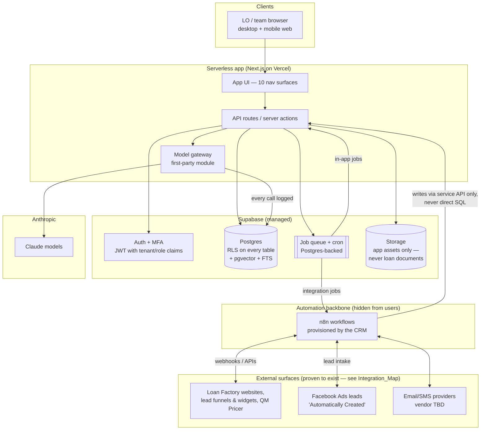

# Technical_Architecture

Purpose: this document is the implementation team's contract for how Loan Factory CRM is built — the recommended stack and the plain-language reasons behind it, the system diagram, how tenant and role separation actually works, where the seams between services are, how background work runs, what environments exist, how we know the system is healthy, and — just as important — what we deliberately do **not** build. It turns [[Decisions]] D-09 (the locked stack) and D-10 (Phase 1 depends on no external integration) into buildable specifics. The data layer it sits on is specified in [[Data_Model]]; the AI behavior it hosts is specified in [[AI_Product_Architecture]]; the automations it executes are cataloged in [[Automation_Catalog]].

---

## 1. Stack at a glance

| Layer | Choice | Status |
|---|---|---|
| Web app | Next.js (App Router) + TypeScript + React | Locked (D-09) |
| Hosting | Serverless (Vercel or equivalent) — no servers we manage | Locked direction; vendor = proposed |
| Database | Supabase Postgres — one database, row-level security (RLS) on every table | Locked (D-09) |
| AI memory & search | pgvector inside the same Postgres + Postgres full-text search | Locked (D-09) |
| Auth | Supabase Auth with MFA; role claims in the session token; RBAC enforced in RLS + application layer | Locked direction |
| AI models | Anthropic Claude family, reached only through a first-party **model gateway** module | Locked (D-09) |
| Automation backbone | n8n (already in Jeremy's stack) running integration workflows **behind** the first-party Automations UX — users never see n8n | Locked (D-09) |
| Background jobs | Postgres-backed queue + scheduled jobs (Supabase cron/queues); n8n for anything touching a third party | Proposed (simplest choice consistent with CANON) |
| Email/SMS delivery | Pluggable provider adapters behind our own `comms` service boundary (vendor selection is an open procurement item — no provider is confirmed) | Proposed |
| File storage | Supabase Storage — light application assets only (campaign and template imagery); the CRM never collects or stores loan documents (that is LOS/POS territory — see [[Integration_Map]]) | Proposed |
| Errors & monitoring | Sentry (app errors) + Vercel/Supabase built-in logs + a small set of product health dashboards | Proposed |

## 2. Why this stack, in plain terms

1. **One team can ship it.** Next.js + Supabase is the highest-leverage combination available to a small team: authentication, database, security rules, file storage, and background scheduling come from one vendor with one bill, and the front end deploys with a git push. No DevOps hire required for Phases 1–2.
2. **Tenant safety lives in the database, not in developer discipline.** Row-level security means the database itself refuses to return another tenant's rows even if application code has a bug. For a product holding borrower information, this is the single most important architectural property (details in §4 and [[Data_Model]] §RLS).
3. **AI memory without a second database.** pgvector lets Ally's semantic search (find the right template, recall past conversations, match a lead to a playbook) live in the same Postgres as the CRM data — same backups, same security rules, no sync pipeline between two stores.
4. **Claude behind a gateway, not sprinkled through the code.** Every AI call goes through one first-party module (§6.4). That is where we enforce the Ally contract — every output lands in an approval queue, every call is logged to `ai_action_log`, every prompt treats retrieved content as untrusted input (prompt-injection posture), and per-tenant spend is capped. Swapping or adding models later is a one-file change.
5. **n8n is a proven asset, hidden on purpose.** Jeremy already runs n8n. It handles the fiddly integration work (webhooks in, third-party APIs out, retries, scheduling) far cheaper than hand-writing it. But n8n's UI is a developer tool, and CANON's "toddler simple" standard bans developer terminology — so LOs configure automations in Loan Factory CRM's own plain-language Automations screens, and the CRM provisions/updates the corresponding n8n workflows behind the scenes (§6.3).
6. **Serverless matches the traffic shape.** A mortgage CRM's load is spiky (Monday mornings, month-end closings) and modest in absolute terms. Serverless scales to zero cost at night and to Monday morning without capacity planning.
7. **The existing prototype constrains nothing.** Per [[Current_State_Audit]] and D-01, the HTML prototype is replaced; nothing in this architecture inherits from it.

## 3. System diagram

Two rules the diagram encodes, worth stating in words:

- **n8n never talks to the database directly.** It calls the CRM's own service API with a scoped service credential, so every automation write passes the same validation, RLS context, audit logging, and Ally approval gates as a human action.
- **The model gateway is the only door to Claude.** No screen, job, or n8n workflow calls Anthropic directly.

## 4. Multi-tenancy model

Loan Factory CRM is **one application, one Postgres database, many tenants** — the standard, boring, safe choice for this stage.

| Question | Answer |
|---|---|
| What is a tenant? | A business unit that owns its data outright — Loan Factory (or a branch/team operating as an isolated book of business) is tenant #1. White-label / multi-brokerage tenanting is Phase 4, but the isolation model is built day one so Phase 4 is configuration, not surgery. |
| How is isolation enforced? | Every table carries `tenant_id`. RLS policies compare it to the `tenant_id` claim baked into the user's session JWT at login. A query without a valid tenant context returns zero rows — by database policy, not by application code. |
| Can a user belong to two tenants? | Not in v1. One user → one tenant (simplest choice consistent with CANON; logged for [[Decisions]]). Cross-tenant needs are solved by separate accounts. |
| What about roles inside a tenant? | RBAC ships as **7 staff role presets + admin in Phases 1–2** (LO, LO assistant, processing/ops, team leader, branch leader, agent relationship manager, marketing coordinator, plus admin) — matching the `user.role` enum in [[Data_Model]]. The 8th CANON persona, the borrower, is **not** an RBAC preset — and not a user at all: borrowers exist only as CRM contact records (see [[Data_Model]]), so no borrower authentication surface, role, or JWT audience exists anywhere in the product. Tenant isolation is the RLS hard wall; **role visibility** (an LO sees their own book, a team leader sees the team's) is enforced by a second layer of RLS policies on ownership/assignment columns plus application checks. Full matrix in [[Data_Model]] and [[Information_Architecture]]. |
| Where do AI and vector data live? | Same database, same `tenant_id`, same RLS. Ally can never retrieve another tenant's memory because the retrieval query runs under the caller's tenant context. |
| Service-role access | Background jobs and n8n use scoped service credentials that **must** set an explicit tenant context per job. No "god-mode" query path exists in application code; the Supabase service key is confined to the job runner and never shipped to the browser or to n8n. |

## 5. Service boundaries

Loan Factory CRM is a **modular monolith**: one deployable app, but the code is organized into five services with hard interfaces, so any of them could be split out later without a rewrite. The boundaries are chosen so that compliance-critical behavior (consent, approvals, audit) each has exactly one owner.

| Service | Owns | Exposes to the others | Never does |
|---|---|---|---|
| **Core CRM** | Tenants, users/roles, people, leads, CRM opportunity records + the 20-stage lifecycle (stage and milestone facts team-entered in v1; later optionally synced read-only from external systems — the CRM never owns loan-of-record data), tasks, notes, partners, segments | CRUD + stage-transition API (stage moves fire domain events) | Send messages; call models; perform loan work (no origination, underwriting, pricing, disclosure, or document collection) |
| **Comms** | Conversations, messages, templates (the 135-template EMT library + variants), campaigns, **consent** enforcement, provider adapters (email/SMS) | `send(message)` — which refuses to send without recorded consent, a resolved template/merge-field set, and (for AI-drafted content) an approval record | Bypass consent or the approval queue — there is deliberately no back door |
| **Automation engine** | Automation definitions (plain-language triggers/conditions/actions), the event catalog from the communication framework, execution runs, the n8n provisioning layer | `on(event) → enqueue actions`; run history for the Automations UX | Auto-send anything policy-tiered Manual Only / Never Automate (hard block per [[Automation_Catalog]]); show n8n to users |
| **AI services (Ally)** | Model gateway, prompt/version registry, retrieval (pgvector), insight generation (briefing, next best action, stall detection, drafts), scoring + `score_snapshot`s, compliance lint (deterministic rules + AI review) | `prepare(draft/insight) → approval queue`; `explain(score)` | Act autonomously; use protected-class or proxy features in scoring (D-11); treat retrieved text as instructions (prompt-injection posture: all retrieved/ingested content is untrusted data) |
| **Analytics** | Read models for Intelligence: pipeline metrics, conversion, partner scorecards, Ally acceptance rates | Query endpoints + materialized views | Write to operational tables |

Cross-cutting and owned by the platform layer, not any one service: `audit_log` (append-only, every mutation), `ai_action_log` (every model call), feature flags, i18n (EN/VI first-class per D-08).

### 5.1 Domain events (the glue)

Services communicate through domain events written to an `events` table (Postgres, transactional with the change that caused them) and consumed by the job queue — no external message bus. The event vocabulary starts from the communication framework's proven trigger catalog (lead captured, stage advanced, disclosures unsigned after delay, appraisal received, clear to close issued, funded, annual review date…) — see [[Automation_Catalog]] for the full list.

## 6. Background job model

Serverless request handlers must return in seconds; everything slower runs as a job.

| Tier | Runs on | Examples | Latency target |
|---|---|---|---|
| **Inline** | Request handler | CRUD, stage move + event insert, reading approval queue | < 1s |
| **Queue jobs** | Postgres-backed queue, worker invoked serverlessly | Ally draft generation, scoring runs, embedding refresh, compliance lint, merge-field resolution, send-time delivery via provider adapter | seconds–minutes |
| **Scheduled** | Supabase cron → queue | Morning briefing build (per user, pre-computed before 7am local), stall sweeps, "going quiet" partner sweeps, annual-review/birthday date triggers, retention purges, disparate-impact scoring review extracts (D-11) | daily/hourly |
| **Integration workflows** | n8n | Facebook/website/widget lead intake webhooks, provider status callbacks (delivered/opened/bounced), future read-only LOS/POS stage/milestone sync (Phase 3) | event-driven |

Rules:

1. **Every job is idempotent and retried with backoff**; poison jobs land in a dead-letter table surfaced on an internal ops dashboard, and user-visible automations show failures in the Automations run history in plain language ("This step failed twice; we'll retry at 2:15pm").
2. **Jobs carry tenant context explicitly** and run under RLS like everything else (§4).
3. **AI jobs end at the approval queue, never at a send.** The only path from a Claude output to a borrower is a human tapping Approve (CANON Ally contract).
4. **Stop conditions override timing** — queued automation sends re-check stop conditions (stage advanced, item received, opt-out, complaint) at execution time, not just at enqueue time, matching the communication framework's governance rule.

## 7. Environments

| Environment | Purpose | Data | Notes |
|---|---|---|---|
| **Local** | Development | Seeded fixtures only | Supabase CLI local stack; mocked model gateway mode (canned responses) so devs don't burn tokens |
| **Preview** | Per-pull-request review | Fixtures | Auto-created by the host per PR; points at the staging Supabase with a disposable schema or branch database |
| **Staging** | Integration + QA | **Fake data only** — the persona pack's data-safety rule ("no external sends, no production writes during testing") adopted wholesale, see [[QA_Plan]] | Own Supabase project, own n8n instance, comms providers in sandbox mode; outbound email/SMS globally suppressed except to an allowlist of team addresses |
| **Production** | Live | Real | Own Supabase project + n8n instance; MFA enforced; access to the database console restricted and audited |

Secrets live in the platform's secret manager per environment; never in the repo, never in n8n workflow JSON (n8n credentials store only), never echoed in logs. Migrations run forward-only through CI (Supabase migration files in the repo, reviewed like code).

## 8. Observability — how we know it's healthy

Three audiences, three layers:

1. **Engineers:** Sentry for exceptions (front and back), structured JSON logs with request/tenant/job IDs, queue depth + dead-letter alerts, Postgres slow-query and connection metrics from Supabase. Page-level web vitals from the host.
2. **The product (Ally accountability):** the `ai_action_log` doubles as AI observability — per-tenant token spend and cost, model latency, and the three numbers that tell us whether Ally is actually good: **approval rate, edit-before-approve rate, rejection rate** per insight/draft type. These feed the Intelligence module and the [[QA_Plan]] AI-review-safety criteria.
3. **Compliance:** every outbound message queryable by consent status at send time; automation run history immutable; scheduled export of `score_snapshot`s for the periodic disparate-impact review (D-11). Alert (not just log) on: any send attempt blocked for missing consent, any attempt to auto-execute a Manual Only/Never Automate template, repeated compliance-lint blocks from one user.

Alerting starts simple: error-rate spike, queue stall > 10 min, briefing job not completed by 7am, provider webhook silence > 1 hour, model gateway error rate. Route to the team's existing channels; no on-call tooling purchase in Phases 1–2.

## 9. What we explicitly defer (and why)

| Not building | Instead | Revisit when |
|---|---|---|
| Microservices / separate deployables | Modular monolith with the 5 hard boundaries in §5 | A service has a genuinely different scaling or team profile — likely never before Phase 4 |
| Custom infrastructure (Kubernetes, self-managed servers, Terraform estates) | Managed serverless + Supabase | Enterprise/white-label requirements (Phase 4) force it |
| External message bus (Kafka/SQS) | `events` table + Postgres queue | Event volume outgrows Postgres (tens of millions/day — far away) |
| Separate search cluster (Elastic/Algolia) | Postgres full-text + pgvector | Search quality measurably fails on real data |
| Data warehouse + BI stack | Materialized views / read models inside Postgres for Intelligence | Analytics queries degrade the operational database |
| Native mobile apps | Responsive web, mobile-first for Today/Pipeline/Conversations (the persona pack's mobile scenarios are the acceptance bar) | Not planned — responsive web on desktop and mobile browsers **is** the product's mobile surface, and it is a hard requirement, not a fallback |
| Multi-region / active-active | Single region + Supabase PITR backups; documented restore runbook | Contractual or scale requirement |
| Self-built email/SMS infrastructure | Provider adapters behind Comms | Never — deliverability is a vendor's job |
| Loan document storage & processing | Nothing — collecting and storing loan documents is LOS/POS work, outside the CRM boundary. The CRM keeps only communication-level facts (e.g. a simple "docs still needed" follow-up flag to drive outreach, see [[Data_Model]]) | Never — this is the product boundary, not a deferral ([[Integration_Map]]) |
| LOS/POS integrations in the core path | Phase 1 runs entirely on captured + manually entered data (D-10). Any future integration is **read-only sync in** (stage/milestone visibility) and communication out — never ownership of loan origination data | Phase 3, after vendor/legal validation — none of these are confirmed today |

## 10. Open technical items (for [[Open_Issues]] / [[Decisions]])

1. Email and SMS provider selection (procurement + deliverability review; SMS additionally needs 10DLC registration and consent-flow legal review). Nothing is confirmed.
2. Hosting vendor confirmation (Vercel assumed; any serverless host with preview deploys works).
3. n8n hosting hardening for production (dedicated instance, credential audit, version pinning).
4. Status-label crosswalk for future read-only LOS/POS sync — before any inbound stage/milestone sync ships (a future integration, not a Phase 1–2 dependency), each external system's milestone labels will need a mapping to the 20-stage enum in [[Data_Model]].

Related: [[Data_Model]] · [[AI_Product_Architecture]] · [[Automation_Catalog]] · [[Integration_Map]] · [[Information_Architecture]] · [[Decisions]]
