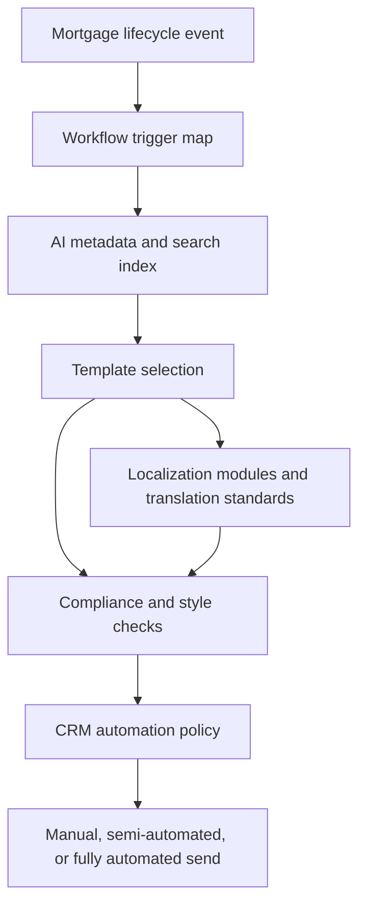

# Email Template Library

## Purpose

This folder contains the Loan Factory and The Legends Mortgage Team multilingual mortgage email template library. It is designed to support clear, compliant, plain-language communication across the full mortgage lifecycle, from first contact through past-client follow up.

The templates are built to match the TERA+ persona framework:

- Plain, direct, helpful voice.
- Broker-first positioning when relevant.
- No hype, pressure, or unsupported promises.
- Short paragraphs and a clear next step.
- External borrower and Realtor templates include compliance notes.
- Multilingual support for English, Vietnamese, Simplified Chinese, Colombian Spanish, and Russian.

## Table Of Contents

- [Library Overview](#library-overview)
- [Architecture Diagram](#architecture-diagram)
- [Lifecycle Map](#lifecycle-map)
- [Folder Map](#folder-map)
- [Files](#files)
- [Statistics](#statistics)
- [Language Support](#language-support)
- [Automation Readiness](#automation-readiness)
- [Compliance Guardrails](#compliance-guardrails)
- [Placeholder Standard](#placeholder-standard)
- [Usage Notes](#usage-notes)
- [Future Roadmap](#future-roadmap)

## Library Overview

The email library has three layers:

1. Human-readable English master templates in files `01` through `14`.
2. Governance, compliance, localization, metadata, search, and automation documentation in files `15` through `29`.
3. YAML metadata on every `EMT-*` template for AI retrieval, CRM automation, QA, and reporting.

## Architecture Diagram



## Lifecycle Map

1. First contact and lead intake.
2. Realtor referral acknowledgement.
3. Pre-approval education and issuance.
4. Application completion and disclosures.
5. Document collection and missing item follow up.
6. Submission to underwriting.
7. Conditional approval and condition clearing.
8. Appraisal, title, and insurance coordination.
9. Closing disclosure, clear to close, closing, and funding.
10. Post-closing thank you, reviews, annual reviews, and refinance opportunities.
11. Realtor partner nurture and co-marketing support.
12. Problem-file, delay, and payment/cash-to-close explanations.

## Folder Map

```text
email-templates/
  README.md
  01-14 English master email template files
  15 Multilingual index and localization modules
  16 Compliance and usage guide
  17-20 Workflow, search, AI metadata, and CRM automation maps
  21-27 Naming, style, SMS, internal/external, translation, best-practice, and checklist docs
  28 Statistics
  29 Roadmap
```

## Files

| File | Purpose |
|---|---|
| [01_Borrower_First_Contact_Templates.md](01_Borrower_First_Contact_Templates.md) | First-contact borrower templates. |
| [02_Realtor_Referral_Templates.md](02_Realtor_Referral_Templates.md) | Realtor referral receipt and partner updates. |
| [03_Pre_Approval_Templates.md](03_Pre_Approval_Templates.md) | Pre-approval, credit prescreen, specialty product, and borrower next-step templates. |
| [04_Document_Collection_Templates.md](04_Document_Collection_Templates.md) | Document request, specialty checklist, gift fund, and missing item templates. |
| [05_Application_and_Disclosure_Templates.md](05_Application_and_Disclosure_Templates.md) | Application, disclosure, DPA, USDA, and specialty program templates. |
| [06_Submitted_to_Underwriting_Templates.md](06_Submitted_to_Underwriting_Templates.md) | Underwriting submission, specialty product, and timing updates. |
| [07_Conditional_Approval_Templates.md](07_Conditional_Approval_Templates.md) | Conditional approval, specialty condition, and condition request templates. |
| [08_Appraisal_Title_Insurance_Templates.md](08_Appraisal_Title_Insurance_Templates.md) | Appraisal, title, insurance, condo, HOA, and property requirement templates. |
| [09_Clear_to_Close_and_Closing_Templates.md](09_Clear_to_Close_and_Closing_Templates.md) | Closing disclosure, clear to close, specialty closing, funding, recording, VOE, and wire fraud templates. |
| [10_Post_Closing_and_Past_Client_Templates.md](10_Post_Closing_and_Past_Client_Templates.md) | Post-closing, review, past-client, anniversary, investor, construction warranty, and refinance templates. |
| [11_Loan_Coordinator_Templates.md](11_Loan_Coordinator_Templates.md) | Coordinator introductions, scheduling, and status nudges. |
| [12_Loan_Processor_Templates.md](12_Loan_Processor_Templates.md) | Processor introductions, underwriting clarification, funding, and third-party coordination. |
| [13_Realtor_Partner_Nurture_Templates.md](13_Realtor_Partner_Nurture_Templates.md) | Realtor nurture, open house, and co-branded marketing templates. |
| [14_Problem_File_and_Delay_Templates.md](14_Problem_File_and_Delay_Templates.md) | Problem-file, rate lock, Loan Estimate, cash-to-close, payment, and delay templates. |
| [15_Multilingual_Email_Template_Index.md](15_Multilingual_Email_Template_Index.md) | Language coverage matrix, placeholder preservation rules, and lifecycle-stage localization modules. |
| [16_Compliance_and_Usage_Guide.md](16_Compliance_and_Usage_Guide.md) | Compliance guardrails, usage rules, and QA checklist. |
| [17_Workflow_Triggers.md](17_Workflow_Triggers.md) | Workflow triggers, timing definitions, stop conditions, and automation policy by template. |
| [18_Search_Index.md](18_Search_Index.md) | Searchable master index for AI retrieval, CRM search, and manual lookup. |
| [19_AI_Metadata.md](19_AI_Metadata.md) | Metadata schema and template metadata table for retrieval systems. |
| [20_CRM_Automation_Map.md](20_CRM_Automation_Map.md) | CRM trigger, delay, prerequisite, stop condition, SMS, task, and notification map. |
| [21_Email_Naming_Convention.md](21_Email_Naming_Convention.md) | Naming, ID, heading, metadata, subject, and versioning conventions. |
| [22_Email_Style_Guide.md](22_Email_Style_Guide.md) | Voice, structure, broker positioning, subject line, and signature style guide. |
| [23_SMS_Cross_Reference.md](23_SMS_Cross_Reference.md) | SMS follow-up guidance mapped to each email template. |
| [24_Internal_vs_External_Communications.md](24_Internal_vs_External_Communications.md) | Privacy-safe routing rules for internal, borrower, Realtor, and partner communications. |
| [25_Translation_Standards.md](25_Translation_Standards.md) | Translation standards, terminology, placeholder rules, and QA checklist. |
| [26_Best_Practices.md](26_Best_Practices.md) | Operational best practices for borrowers, Realtors, AI usage, and automation. |
| [27_Email_Checklists.md](27_Email_Checklists.md) | Pre-send, borrower, Realtor, automation, AI retrieval, translation, and compliance checklists. |
| [28_Email_Library_Statistics.md](28_Email_Library_Statistics.md) | Template counts by stage, audience, timing, automation readiness, and language coverage. |
| [29_Roadmap.md](29_Roadmap.md) | Quality, localization, CRM, AI, and expansion roadmap. |

## Statistics

| Metric | Count |
|---|---:|
| English master templates | 135 |
| Template files 01-14 | 14 |
| Governance and index files 15-29 | 15 |
| Email library markdown files including README | 30 |
| Repository languages | 5 |
| Templates with YAML metadata | 135 |

## Language Support

- English
- Vietnamese
- Simplified Chinese
- Colombian Spanish
- Russian

English master templates are the source of truth. File `15` provides lifecycle-stage localization modules for Vietnamese, Simplified Chinese, Colombian Spanish, and Russian. Full per-template localized variants should be created and reviewed before live multilingual sending.

## Automation Readiness

Automation policy is defined at the template level in YAML metadata and in [20_CRM_Automation_Map.md](20_CRM_Automation_Map.md).

| Policy | Meaning |
|---|---|
| Fully Automated | May be sent by CRM after source trigger, prerequisites, stop conditions, consent, and merge fields are verified. |
| Semi Automated | CRM may stage or suggest the template, but a human should review before sending. |
| Manual Only | Human review required before sending. |
| Never Automate | Do not send automatically. |

## Compliance Guardrails

- Do not promise approval, closing, rate, payment, program eligibility, or cash to close.
- Do not imply final loan terms before underwriting, appraisal, title, insurance, and lender review are complete.
- Keep pricing, lock, payment, and Loan Estimate explanations conditional and educational.
- No referral fee, thing of value, or marketing support may be offered or provided in exchange for settlement-service referrals.
- Co-marketing must be reviewed and documented before use.
- Use the compliance line when the template is marketing focused or borrower facing and appropriate:

Equal Housing Opportunity. Loan Factory, Inc. NMLS 320841. Jeremy McDonald NMLS 1195266.

## Placeholder Standard

Use only the approved placeholder format:

`{{BorrowerName}}`, `{{RealtorName}}`, `{{PropertyAddress}}`, `{{LoanOfficerName}}`, `{{LoanCoordinatorName}}`, `{{ProcessorName}}`, `{{ClosingDate}}`, `{{AppraisalDate}}`, `{{AppraisalDueDate}}`, `{{LenderName}}`, `{{LoanProgram}}`, `{{ApplicationLink}}`, `{{PhoneNumber}}`, `{{EmailAddress}}`, `{{Website}}`, `{{NMLS}}`, `{{CompanyNMLS}}`

## Usage Notes

- Use the English master template first.
- Check the compliance notes before sending.
- Replace every required placeholder.
- Confirm that any rate, payment, cash-to-close, approval, or closing language is still accurate before sending.
- Use the multilingual index and translation standards when a borrower, Realtor, or partner needs a localized version.
- Use the CRM automation map before enabling any workflow.

## Future Roadmap

See [29_Roadmap.md](29_Roadmap.md). Highest-priority next steps are compliance approval, full per-template localization for high-volume templates, CRM/TERA+ trigger mapping, sandbox automation testing with fake records, and AI retrieval governance.
